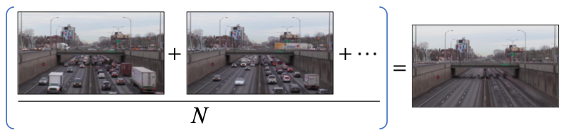
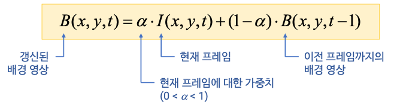
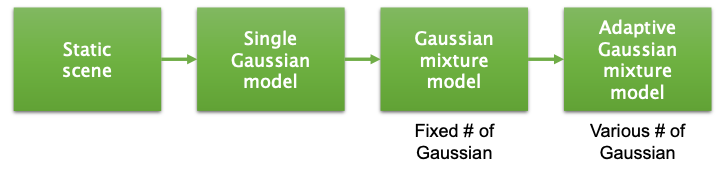
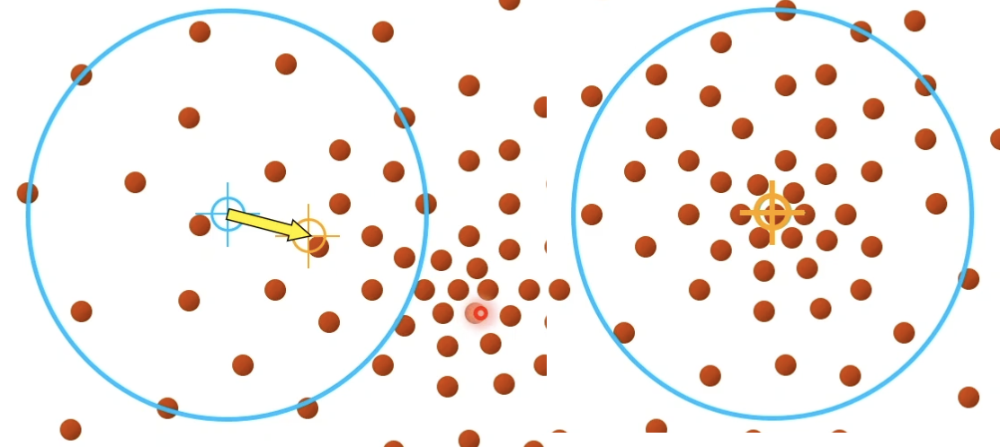
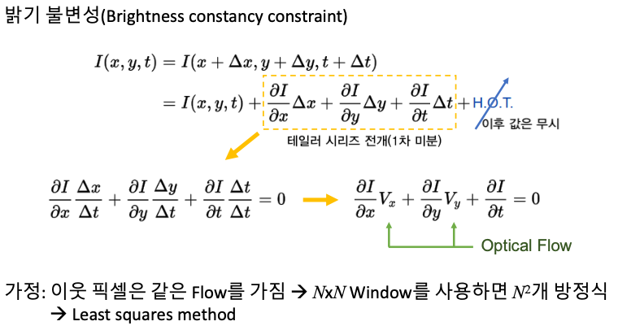
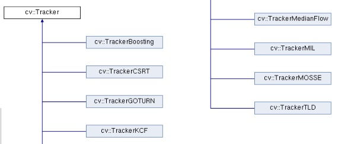
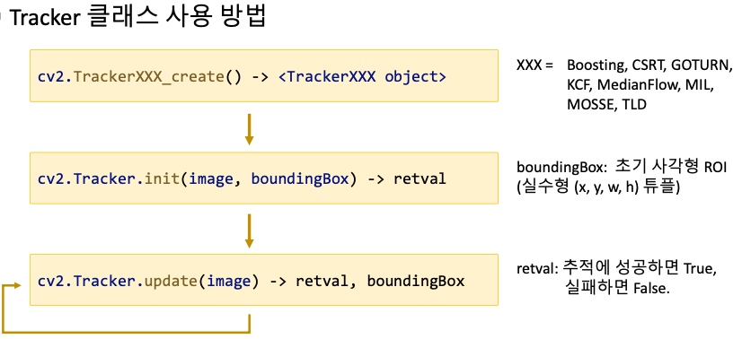

# 9. 객체 추적과 모션 벡터

## 1. 배경 차분(Background Subtraction,BS)
> 움직이는 전경 객체 검출을 위한 기본적인 방법
> 정적(Static) / 이동 평균(Moving Average) / MOG(Mixture of Gaussian)
### 1.1 정적 배경 차분
. 


가우시안 필터 + 차 영상을 통해 움직이는 전경 객체를 검출한다.  
문제점  : 미리 등록된 기준 영상이 실제 배경과 크게 달라질 경우 오동작한다(새로운 객체가 화면에 고정, 조도 변경 등)  
-> 배경 모델에 대한 주기적인 업데이트가 필요하다.  

### 1.2 이동 평균 배경
정적 배경 모델의 문제점을 해결하기 위한 방법.  
* 평균 연산에 의한 배경 영상 생성
. 
-> 수백장의 이전 프레임을 저장해야 하기 때문에 대용량 메모리가 필요하다.
* 이동 평균
	매 프레임이 들어올 때마다 평균 영상을 갱신  
	. 
	```python
	cv2.accumulateWeighted(src, dst, alpha, mask=None) -> dst
	```
	`src` : 입력 영상. 해당 계산시 실수형으로 진행되게 해주어야한다.  
	`dst` : 축적 영상. 리턴값으로 받지말고 인자로 넣어줘야 됨.(계산 시 이용하는 dst의  경우). 
	`alpha` : `0.01` 정도의 값. 적절한 값을 고민해서 넣어줘야 됨.  

### 1.3 MOG 배경 
Mixture of Gaussian, GMM(Gaussian Mixture Model). 
각 픽셀에 대해 MOG 확률 모델을 설정하여 배경과 전경을 구분한다.  
. 


OpenCV에서 제공하는 배경 추정 알고리즘  
`cv2.BackgroundSubtractor` 클래스를 상속받는 `cv2.BackgroundSubtractorKNN` , `BackgroundSubtractorMOG2` 를 주로 사용한다.  
[해당 논문](http://mhs.uks.ac.id/Referensi%20Kuliah/contoh%20jurnal/jurnal%201.pdf)에서 제시하는 방법을 구현한 클래스.  

* 클래스 사용방법
	```python
	# 클래스 선언
	 cv2.createBackgroundSubtractorMOG2(,history=None, varThreshold=None, detectShadows=None) -> dst
	 cv2.createBackgroundSubtractorKNN( ... )
	```
	`history` : 히스토리 길이, 기본값 500.  
	`varThreshold` : 픽셀과 모델 사이의 [마할라노비스 거리](https://en.wikipedia.org/wiki/Mahalanobis_distance) 제곱에 대한 임계값.  
	해당 픽셀이 배경 모델에 의해 잘 표현되는 지를 판단. 기본값 16.  
	`detectShadows` : 그림자 검출 여부. 기본값 True.(회색으로 검출).  

	```python 
	# 전면 객체 마스크 생성 함수
	cv2.BackgroundSubtractor.apply(image, fgmask=None, learningRate=None) -> fgmask
	# 배경 영상 반환 함수
	cv2.BackgroundSubtractor.getBackgroundImage(,) -> backgroundImage
	```
	`image` : 비디오 프레임.  
	`fgmask` : 전경 마스크 영상. 8비트 이진 영상.  
	`learningRate` : 배경 모델 학습 속도 지정. 기본값 `-1(자동)`, `0(갱신X)`, `1(매 프레임)`.  

> 둘 중 어느게 더 낫다라기 보단 내가 사용할 영상에서 잘 작동하는 것을 골라 쓰면 된다. 

## 2. 추적
> `추적(tracking)` : 동영상에서 특정 대상의 위치 변화를 알아내는 작업.  
`검출(Detection)` : 영상에서 찾고자 하는 대상의 위치와 크기를  알아내는 작업.  
`인식(Recognition)` : 주어진 영상이 무엇인지 판별하는 작업(classification, identification).  
Mean Shift / Cam Shift / Optical Flow / OpenCV tracker.  

### 2.1 평균 이동 알고리즘
> A non-parametric feature-space analysis technique for locating the maxima of a density function.  
국지적 평균을 탐색하면서 이동한다.  
. 
```python
cv2.meanShift(probImage, window, criteria) -> retval, window
```
`probImage` : 관심 객체에 대한 히스토그램 역투영 영상(확률 영상)  
`window` : 초기 검색 영역 윈도우 + 결과 영역 반환(둘다 넣어줘야댐), 사각형 정보.  
`criteria` : 종료 기준. (type,maxCount, epsilon) 튜플.  
-> `term_crit = (cv2.TERM_CRITERA_EPS | cv2.TERM_CRITERA_COUNT, 10,1)`.  
`retval` : 알고리즘 내부 반복 횟수  

단점 : 검색 윈도우 크기가 고정되어 있다.  

### 2.2 Cam Shift 알고리즘
>Continuously Adaptive Mean Shift 
>검색 윈도우 크기가 고정되어 있는 Mean Shift 의 단점을 보완.

캠시프트 동작 방법
	1.  우선 평균 이동 알고리즘을 이동 위치 계산 
	2. 윈도우 크기를 조정(OpenCV에선 상하 좌우 10픽셀씩 확장)
	3. 특징 공간을 가장 잘 표현하는 타원 검출
	4. 새로운 크기의 윈도우를 이용하여 다시 평균 이동 수행
  
`cv2.CamShift(...) -> retval, window` : 인자는 `meanShift` 와 동일.  
`retval` : 추적하는 객체의 모양을 나타내는 회전된 사각형 정보 반환.  
`((cx,cy),(width,height),angle)` 튜플 -> `cv2.ellipse` 함수로 그려줌.  


### 2.3 Optical Flow
> 연속하는 두 프레임(영상) 에서 카메라 또는 객체의 움직임에 의해 나타나는 객체의 이동 정보 패턴.  
> 활용 분야 : Structure from Motion, Video Compression, Video Stabilization 등등

옵티컬플로우 계산  
. 


#### 2.3.1 루카스-카나데 알고리즘
> 주로 `Sparse points` 에 대한 이동 벡터 계산 -> **특정 픽셀** 에서 옵티컬 플로우 계산
```python
cv2.calcOpticalFlowPyrLK(prevImg, nextImg, prevPts, nextPts, status=None, err=None, winSize=None, maxLevel=None, criteria=None, flags=None, minEigThreshold=None) -> nextPts, status, err
```
`prevImg,nextImg` : 이전 프레임과 현제 프레임. 8비트 입력 영상.  
`prevPts` : 이전 프레임에서 추적할 점들. `shape=(N,1,2)`.  
`nextPts` : `prevPts` 가 이동한 현재 프레임 좌표.(리턴값으로 받아줌).  
`status` : 점들의 매칭 상태. `shape=(N,1)` , `1` 이면 잘한거, `0` 이면 못한거.  
`err` : 결과 오차 정보. `shape=(N,1)`.  
나머지 인자는 기본값 써도 무방. 필요할 때 찾아서 쓰면됨  

#### 2.3.2 파네백 알고리즘
> 주로 `Dense points` 에 대한 이동 벡터 계산 -> **모든 픽셀** 에서 옵티컬 플로우 계산
```python
cv2.calcOpticalFlowFarneback(prev, next, flow, pyr_scale, levels, winsize, iterations, poly_n, poly_sigma, flags) -> flow
```
`prev,next` : 이전 영상과 현재 영상. grayscale 영상.  
`flow` : 계산된 옵티컬 플로우 `shape=(h,w,2)`.  
나머지 인자에 대해서는 [파네백 클래스 생성자 참고](https://docs.opencv.org/master/de/d9e/classcv_1_1FarnebackOpticalFlow.html#a4ce7a192171d340ea19e1fd670b231e7).  
예) `cv2.calcOpticalFlowFarneback(gray1, gray2, None, 0.5, 3, 13, 3, 5, 1.1, 0)`.  

> 각각의 함수로 사용해도 되고 , 클래스 형태로 가져와서 사용해도 된다.


### 2.4 OpenCV Tracker
. 
. 

> KCF, MOSSE 가 속도가 빠르고 무난하다. CSRT 가 정확하지만 느리다.  
> 객체가 사라지거나 가려지는 경우엔 추적하지 못하기 때문에 그런 경우를 고려해서 구현을 해줘야한다.


## 3. 실습
* 핸드 모션 리모컨  
  카메라로 손 움직임을 분석하여 상하좌우 방향을 인식
* 구현할 기술  
  움직임이 있는 영역 검출( 파네백 함수 이용, 영상 크기 1/2 계산)
  움직임이 있는 영역에서 움직임 벡터의 평균 방향 검출
