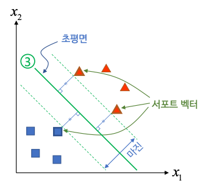
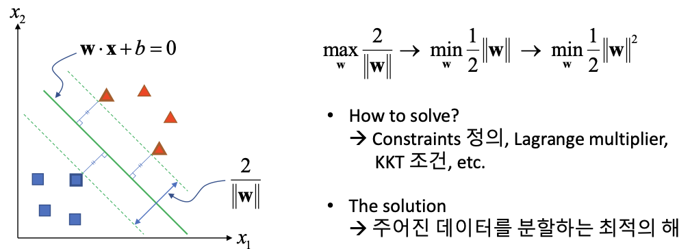
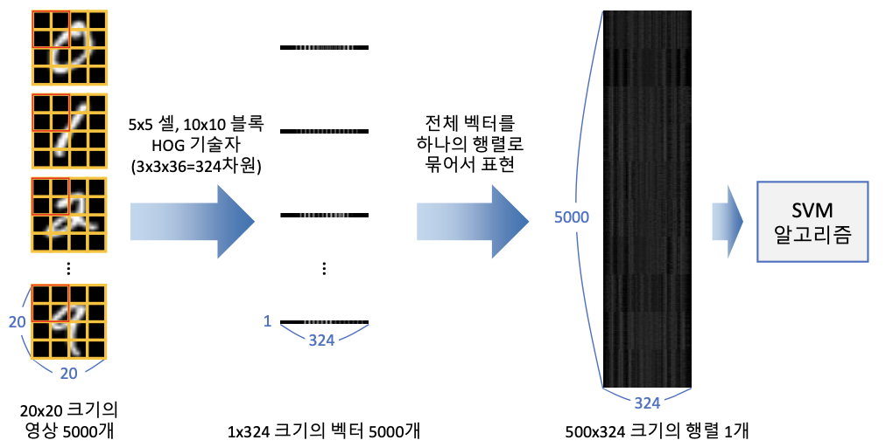
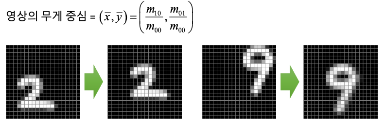

# 10. 머신러닝
>주어진 데이터를 분석하여 규칙성, 패턴 등을 찾고, 이를 이용하여 의미있는 정보를 추출하는 과정

* 머신러닝의 종류


* 머신 러닝 단계
	**학습(Train)** : 학습데이터를이용하여모델을학습하는과정.  
	**예측(Predict)** : 학습된 모델을 이용하여 새로운 데이터로부터 적절한 값을 예측하는 과정. **추론(Inference)**.  
	

* 머신 러닝 학습의 목적  
	미래의 새로운 데이터를 더 정확하게 예측 하기위함.  
	➔ 모델의 일반화(generalization) 성능을 향상시키는 방향으로 학습해야 함.

* 과적합(overfitting)  
	학습 데이터셋을 지나치게 정확하게 구분하도록 학습하여 모델의일반화 성능이 떨어지게 되는 현상.  
	과적합 발생원인.  
	1. 학습 데이터셋 문제  
		학습 데이터셋이 너무 적은경우.  
		학습 데이터 셋이 전체 데이터셋의 특성/분포를 반영하지 않는 경우.  
	2. 모델문제 
		모델이 복잡할수록 과적합 발생 확률이 높음

* 학습 데이터 분할
	학습 가능한 데이터를 학습, 검증, 테스트 데이터셋으로 분할하여사용  
	➔ K-fold 교차 검증(K-fold cross validation) : 학습 데이터를 K개로 분할하여 여러 번 검증 수행


## 1. OpenCV 머신 러닝 클래스


|클래스 이름|설명|
|-----|---|
|ANN_MLP|인공 신경망(artificial neural network) 다층 퍼셉트론(multi-layer perceptron). 여러 개의 ANN_MLP 은닉층을 포함한 신경망을 학습시킬 수 있고, 입력 데이터에 대한 결과를 예측|
|DTrees|이진 의사 결정 트리(decision trees) 알고리즘.|
|Boost|부스팅(boostring) 알고리즘. 다수의 약한 분류기(weak classifier)에 적절한 가중치를 부여하여 성능이 좋은 분류기를 만드는 방법|
|RTrees|랜덤 트리(random tree) 또는 랜덤 포레스트(random forest) 알고리즘. 입력 특징 벡터를 다수의 트리로 예측하고, 그 결과를 취합하여 분류 또는 회귀를 수행|
|EM|기댓값 최대화(Expectation Maximization). 가우시안 혼합 모델(Gaussian mixture model)을 이용한 군집화 알고리즘|
|KNearest|K 최근접 이웃(K-Nearest Neighbors) 알고리즘. K 최근접 이웃 알고리즘은 샘플 데이터와 KNearest 인접한 K개의 학습 데이터를 찾고, 이 중 가장 많은 개수에 해당하는 클래스를 샘플 데이터 클래스로 지정|
|LogisticRegression|로지스틱 회귀(logistic regression). |
|NormalBayesClassifier|정규 베이즈 분류기. 정규 베이즈 분류기는 각 클래스의 특징 벡터가 정규 분포를 따른다고 가정. 따라서 전체 데이터 분포는 가우시안 혼합 모델로 표현 가능.정규 베이즈 분류기는 학습 데이터로부터 각 클래스의 평균 벡터와 공분산 행렬을 계산하고, 이를 예측에 사용한다.|
|SVM|Support Vector Machine 알고리즘. 두 클래스의 데이터를 가장 여유 있게 분리하는 초평면을 구함. 커널 기법을 이용하여 비선형 데이터 분류에도 사용할수 있고, 다중 클래스분류 및 회귀에도 적용할수있습니다.|
|SVMSDG|통계적 그래디언트 하향(stochastic gradient descent) SVM. 통계적 그래디언트 하향 방법을 SVM에 적용함으로써 대용량 데이터에 대해서도 빠른 학습이 가능.|

학습 및 예측 
```python
cv2.ml_StatModel.train(samples, layout, responses) -> retval
cv2.ml_StatModel.predict(samples, result=None, flags=None) -> retval , result
```
`samples` : 학습/입력 데이터 행렬. `shape=(N,d)`.  
`layout` : 학습 데이터 배치 방법. `cv2.ROW_SAMPLE` , `cv2.COL_SAMPLE`.  
`responses` : 각 학습 데이터에 대응되는 레이블 행렬. `shape=(N,1)`.
`result` : 예측 결과 행렬. `shape=(N,1) or (N,)`.  
`flags` : 추가적인 플래그, 기본값 0.  

## 2. KNN(K-Nearest Neighbor)
> 특징 공간에서 테스트 데이터와 가장 가까이 있는 K개의 학습 데이터를 찾아 분류 또는 회귀를 수행하는 지도 학습 알고리즘.


* KNN 클래스
	```python
	# 객체 생성
	cv2.ml.KNearest_create() -> retval
	# 예측(predict 대신 쓰는 이유 : K 값을 인자로 줄수 있음)
	cv2.ml_KNearest.findNearest(sample, k, ... ) 
					-> retval, results, neighborResponses, dist
	```
	`k` : 사용할 최근접 이웃 개수  
	`results` : 예측 결과 행렬  
	`neighborResponses` : 예측에 사용된 k개의 최근접 이웃 클래스 정보 행렬. `shape=(N,K)`.  
	`dist` : `samples` 와 `neighborResponses` 의 거리를 저장한 행렬. `shape=(N,K)`. 
	`retval` : 입력 벡터가 하나인 경우에 대한 응답.  

* KNN 필기체 숫자 인식
	가장 간단한 형태의 필기체 숫자 인식 방법. -> 성능이 제일 좋은건 아니다.  
	OpenCV 에서 제공하는 필기체 숫자 이미지를 활용. [digit.png](https://github.com/opencv/opencv/blob/master/samples/data/digits.png).  
	


## 3. SVM(Support Vector Machine)
>두 개의 그룹(데이터)를 분리하는 방법으로 데이터들과 거리가 가장 먼 초평면(hyperplane)을 선택하여 분리하는 방법(maximum margin classifier)

.  

* 최대 마진 초평면 구하기
	초평면 : $w*x + b = 0$  
	마진($\frac{2}{||w||}$)을 최대로 만드는 $w$ 구하기
	.  
* 오분류 에러 허용하기
	완벽하게 두 그룹으로 선형 분리할 수 없는 경우, 오분류 에러를 허용(Soft margin, C-SVM).  
	$min \frac{1}{2}||w||^2$ -> $min \frac{1}{2}||w||^2+C\sum\limits_{i=1}^N\epsilon_i$.  
	C 값은 사용자가 설정하는 파라미터  
	C 값이 크면(작으면) 오분류 에러 작아지고(커지고), 마진도 작아짐(커짐).  
	-> 적절한 C 값을 설정해주어야 한다.  

* 비선형 데이터 분리하기
	비선형 데이터의 차원을 확장하면 선형으로 분리 가능.  
	매핑 함수를 직접 사용하는 대신 SVM 초평면 계산에서 사용되는 벡터 내적 연산을 대체하는 비선형 커널 함수를 정의하여 사용. -> **커널 트릭(Kernel trick)**  
	주요 커널 함수
	* 다항식 커널 함수(Polynomial) : $K(x_i,x_j) = (x_i*x_j + 1)^d$.  (d : 변경할 차원 수)  
	* 방사 기저 함수(Radial basis function) : $K(x_i,x_j) = exp(-\gamma||x_i-x_j||^2$.  
		자주 사용되는 커널 함수.  
		$\gamma$ 값이 크면 학습 데이터에 크게 의존적. -> 복잡한 결정 평면 & 과적합  
		$\gamma$ 값이 작으면 학습 데이터 분포를 대략적 -> 단순한 결정 평면.  

### 3.1 OpenCV SVM
> 자세한 내용은 공식문서 참고 [링크](https://docs.opencv.org/master/d1/d2d/classcv_1_1ml_1_1SVM.html#aad7f1aaccced3c33bb256640910a0e56)
* SVM 객체 생성
`cv2.ml.SVM_create() -> retval` : `cv2.ml_SVM` 객체.
* SVM 타입 지정
`cv2.ml_SVM.setType(type) -> None`.
`cv2.ml.SVM_C_SVC` : C-SVM. 일반적인 n-클래스 분류 사용. -> `C` 파라미터.   
`cv2.ml.SVM_ONE_CLASS` : 1-분류 SVM. 데이터 분포 측정 사용 -> `C,Nu` 파라미터.  
* SVM 커널 지정
	`cv2.ml_SVM.setKernel(kernelType) -> None`.  
	`cv2.ml.SVM_LINEAR`, `cv2.ml.SVM_POLY` , `cv2.ml.SVM_RBF` 를 주로 사용.  

* SVM 자동 학습(k-fold 교차 검증)
	`sckit-learn` 에서 제공하는 `gridSearch` 와 유사한 함수.  
	파라미터 범위를 자동으로 설정. 학습 후 베스트 파라미터를 알려준다.  
	`cv2.ml_SVM.trainAuto(samples, layout, responses, kFold=None, ...) -> retval`  
	`cv2.ml_StatModel.train` 와 같은 파라미터.  
	오래걸리는 단점이 있기 때문에 일부 데이터만으로 학습 시킨 후 나온 파라미터를 가지고 전체 데이터 학습시키는 방법이 효율적이다.  

### 3.2 HOG & SVM 필기체 숫자 인식
.  

`HOG.compute` 시 `shape=(324,1)` 의 벡터 리턴됨.  
-> 하나의 행렬로 묶어서 표현하게 되면 `shape=(5000,324,1)`  
-> `np.squeeze` 로 `shape=(5000,324)`  
-> testImg 를 넣어줄 땐  `HOG.compute()` 리턴 벡터의 전치 행렬(Transpose)로.  

```python
# 학습된 svm 모델 저장
svm.save("~.yml")
# 학습된 svm 모델 읽어오기
cv2.ml.SVM_load(path) -> retval 
```

## 4. 영상 정규화
> 학습 데이터 영상과 테스트 데이터 영상의 **위치**,**크기**,**회전** 등의 요소를 정규화 -> 인식 성능 향상.  
> 어떤 방법으로 정규화 할지를 고민하는 것이 성능 향상에 큰 도움이 된다.  

* SVM 필기체 숫자 인식 정규화.
	숫자 영상의 무게 중심이 전체 영상 중앙이 되도록 **위치 정규화**.  
	.  
	`cv2.moments(img) -> dict` : 모멘트 계산 함수. 위 식으로 무게 중심 계산.  


## 5. K-평균 알고리즘
> 주어진 데이터를 K개의 구역으로 나누는 군집화 알고리즘(비지도 학습)  
> 입력 데이터를 K 개로 단순한 형태로 보기 위해서 사용.  

* 수식 : $argmin \sum\limits_{i=1}^k\sum\limits_{x\in S_i}||x - \mu_i||^2$
* 동작순서  
	1. 임의의K개중심을선정  
	2. 모든데이터에대하여가장가까운중심을선택 3. 각군집에대해중심을다시계산  
	3. 중심이변경되면2~3과정을반복  
	4. 그렇지않으면종료  

* 컬러 영상 분할
	입력 영상의 각 픽셀 값을 색 공간 상의 한 점으로 표현.  
	예) RGB 3차원 공간에서의 한 점, HS 2차원 공간에서의 한 점.  
	색 공간에서 k-mean 알고리즘 수행. -> 각 픽셀 값을 k개의 대표 색상으로 치환.  

* K-mean 군집화 함수
	```python
	cv2.kmeans(data, K, bestLabels, criteria, attempts, flags, centers=None) -> retval, bestLabels, centers
	```
	`data` : 학습 데이터 행렬. `shape=(N,d)`.  
	`bestLabels` : 각 샘플의 군집 번호 행렬. `shape=(N,1)`. 리턴 값으로 받아줌.  
	`criteria` : 종료기준. `(type,maxCount,epsilon)` 튜플.  
	`attempts` : 반복 실행할 횟수.  
	`flags` : 초기 중앙 설정방법. 주로 `cv2.KMEANS_RANDOM_CENTERS` 방법.  
	`centers` : 군집 중심을 나타내는 행렬. `shape=(N,d)`.  
	`retval` : Compactness measure. 클래스 별 중심 점과의 평균 거리.  
	
## 6. 실습
문서에서 필기체 숫자 인식.  
* 구현할 기술  
	* 각 숫자의 부분 영상 추출  
		레이블링 이용 -> 각 숫자의 바운딩 박스 정보 추출  
	* 숫자 부분 영상을 정규화 과정을 거쳐 20x20크기로 resize  
		숫자의 바운딩 박스 부분 영상의 가로/세로 비율을 유지 할 것.  
		학습에 사용된 숫자 영상이 꽉 찬 형태가 아니므로 적절한 여백 유지.  
	* HOG & SVM 방법으로 숫자인식  


> 어떤 알고리즘을 쓰는 것보다 실제 추출하고자 하는 객체를 어떻게 **정규화** 할 지를 고민하는 게 더욱 중요하다.
