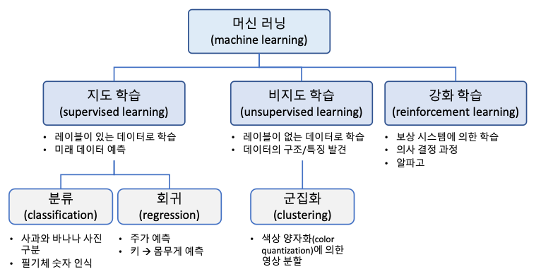
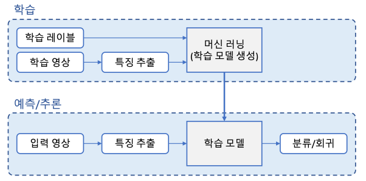
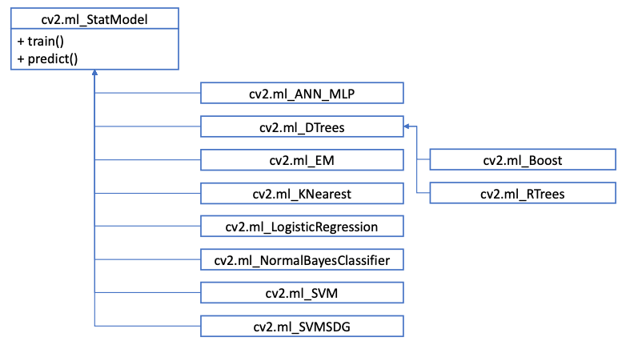
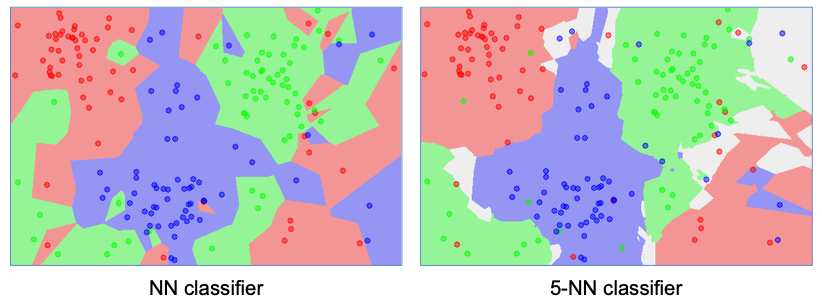
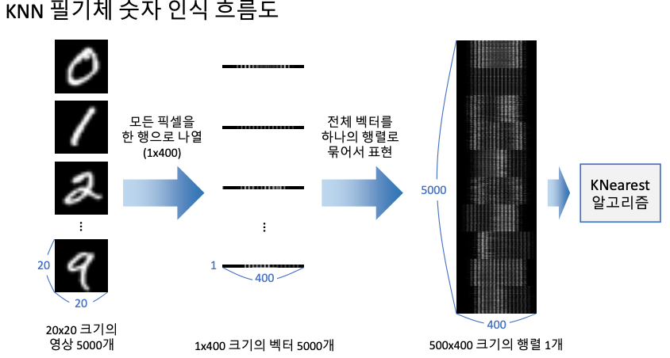

# 10. 머신러닝
>주어진 데이터를 분석하여 규칙성, 패턴 등을 찾고, 이를 이용하여 의미있는 정보를 추출하는 과정

* 머신러닝의 종류


* 머신 러닝 단계
	**학습(Train)** : 학습데이터를이용하여모델을학습하는과정.  
	**예측(Predict)** : 학습된 모델을 이용하여 새로운 데이터로부터 적절한 값을 예측하는 과정. **추론(Inference)**.  
	

* 머신 러닝 학습의 목적  
	미래의 새로운 데이터를 더 정확하게 예측 하기위함.  
	➔ 모델의 일반화(generalization) 성능을 향상시키는 방향으로 학습해야 함.

* 과적합(overfitting)  
	학습 데이터셋을 지나치게 정확하게 구분하도록 학습하여 모델의일반화 성능이 떨어지게 되는 현상.  
	과적합 발생원인.  
	1. 학습 데이터셋 문제  
		학습 데이터셋이 너무 적은경우.  
		학습 데이터 셋이 전체 데이터셋의 특성/분포를 반영하지 않는 경우.  
	2. 모델문제 
		모델이 복잡할수록 과적합 발생 확률이 높음

* 학습 데이터 분할
	학습 가능한 데이터를 학습, 검증, 테스트 데이터셋으로 분할하여사용  
	➔ K-fold 교차 검증(K-fold cross validation) : 학습 데이터를 K개로 분할하여 여러 번 검증 수행


## 1. OpenCV 머신 러닝 클래스



|클래스 이름|설명|
|-----|---|
|ANN_MLP|인공 신경망(artificial neural network) 다층 퍼셉트론(multi-layer perceptron). 여러 개의 ANN_MLP 은닉층을 포함한 신경망을 학습시킬 수 있고, 입력 데이터에 대한 결과를 예측|
|DTrees|이진 의사 결정 트리(decision trees) 알고리즘.|
|Boost|부스팅(boostring) 알고리즘. 다수의 약한 분류기(weak classifier)에 적절한 가중치를 부여하여 성능이 좋은 분류기를 만드는 방법|
|RTrees|랜덤 트리(random tree) 또는 랜덤 포레스트(random forest) 알고리즘. 입력 특징 벡터를 다수의 트리로 예측하고, 그 결과를 취합하여 분류 또는 회귀를 수행|
|EM|기댓값 최대화(Expectation Maximization). 가우시안 혼합 모델(Gaussian mixture model)을 이용한 군집화 알고리즘|
|KNearest|K 최근접 이웃(K-Nearest Neighbors) 알고리즘. K 최근접 이웃 알고리즘은 샘플 데이터와 KNearest 인접한 K개의 학습 데이터를 찾고, 이 중 가장 많은 개수에 해당하는 클래스를 샘플 데이터 클래스로 지정|
|LogisticRegression|로지스틱 회귀(logistic regression). |
|NormalBayesClassifier|정규 베이즈 분류기. 정규 베이즈 분류기는 각 클래스의 특징 벡터가 정규 분포를 따른다고 가정. 따라서 전체 데이터 분포는 가우시안 혼합 모델로 표현 가능.정규 베이즈 분류기는 학습 데이터로부터 각 클래스의 평균 벡터와 공분산 행렬을 계산하고, 이를 예측에 사용한다.|
|SVM|Support Vector Machine 알고리즘. 두 클래스의 데이터를 가장 여유 있게 분리하는 초평면을 구함. 커널 기법을 이용하여 비선형 데이터 분류에도 사용할수 있고, 다중 클래스분류 및 회귀에도 적용할수있습니다.|
|SVMSDG|통계적 그래디언트 하향(stochastic gradient descent) SVM. 통계적 그래디언트 하향 방법을 SVM에 적용함으로써 대용량 데이터에 대해서도 빠른 학습이 가능.|

학습 및 예측 
```python
cv2.ml_StatModel.train(samples, layout, responses) -> retval
cv2.ml_StatModel.predict(samples, result=None, flags=None) -> retval , result
```
`samples` : 학습/입력 데이터 행렬. `shape=(N,d)`.  
`layout` : 학습 데이터 배치 방법. `cv2.ROW_SAMPLE` , `cv2.COL_SAMPLE`.  
`responses` : 각 학습 데이터에 대응되는 레이블 행렬. `shape=(N,1)`.
`result` : 예측 결과 행렬. `shape=(N,1) or (N,)`.  
`flags` : 추가적인 플래그, 기본값 0.  

## 2. KNN(K-Nearest Neighbor)
> 특징 공간에서 테스트 데이터와 가장 가까이 있는 K개의 학습 데이터를 찾아 분류 또는 회귀를 수행하는 지도 학습 알고리즘.


* KNN 클래스
	```python
	# 객체 생성
	cv2.ml.KNearest_create() -> retval
	# 예측(predict 대신 쓰는 이유 : K 값을 인자로 줄수 있음)
	cv2.ml_KNearest.findNearest(sample, k, ... ) 
					-> retval, results, neighborResponses, dist
	```
	`k` : 사용할 최근접 이웃 개수  
	`results` : 예측 결과 행렬  
	`neighborResponses` : 예측에 사용된 k개의 최근접 이웃 클래스 정보 행렬. `shape=(N,K)`.  
	`dist` : `samples` 와 `neighborResponses` 의 거리를 저장한 행렬. `shape=(N,K)`. 
	`retval` : 입력 벡터가 하나인 경우에 대한 응답.  

* KNN 필기체 숫자 인식
	가장 간단한 형태의 필기체 숫자 인식 방법. -> 성능이 제일 좋은건 아니다.  
	OpenCV 에서 제공하는 필기체 숫자 이미지를 활용. [digit.png](https://github.com/opencv/opencv/blob/master/samples/data/digits.png).  
	


