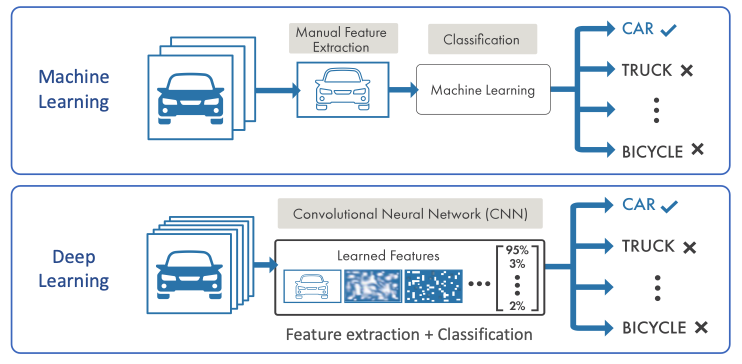
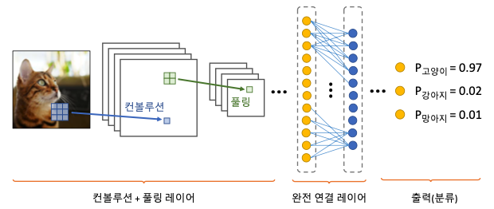
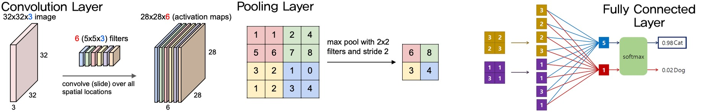
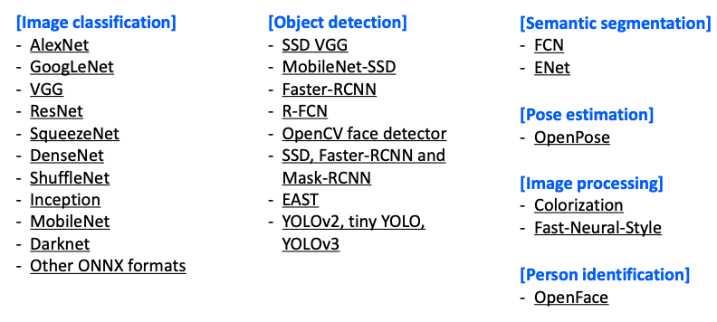
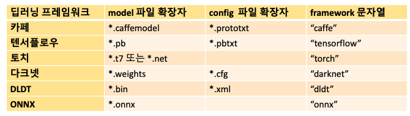

# 11. 딥러닝 이해와 영상 인식

## 1. 딥러닝 이해하기
> 2000년대부터 사용되고 있는 심층 신경망(deep neural network) 의 또 다른 이름.

* 머신 러닝(ML) vs 딥러닝(DL).  
	.  
	Feature extraction 을 유저가 직접하는 것과 모델 안에서 동작하는 것의 차이.  

* 영상에서 딥러닝 활용
	이미지 인식(Image Recognition)  
	객체 분할(Object segmentation)  
	해상도(Super-Resolution)  
	영상 변환(Image-to-Image translation) : 낮 -> 밤.  
	영상 인페인팅(Image Inpainting) : 누락된 부분 영상을 채워주는 작업.   

* 기본적인 딥러닝 용어.  
	`퍼셉트론(Perceptron)` : 다수의 입력으로부터 가중합을 계산, 이를 이용해 하나의 출력을 만드는 구조.  
	`활성화 함수(Activation Function)` : 생물학적 뉴런(neuron)에서 입력신호가 일정크기 이상일때만 신호를 전달하는 메커니즘을 모방, 비선형함수를사용(`sigmoid`,'relu' 등).  
	`(단층)퍼셉트론` : 입력층 -> 출력층.  
	`다층 퍼셉트론(MLP)` : 은닉층이 한 개 이상.  
	`심층 신경망(DNN)` : 은닉층이 두 개 이상.  
	`학습` : `가중치(weight)`를 결정하는 방법. 기준이 되는 `손실(loss)함수` 정의 후 최소화하는 방향으로 학습.  
	`경사하강법(Gradient descent)` : 그래디언트 반대 방향으로 이동하면서 최솟값 위치를 찾는 방법.  
	`오류역전파(error Backpropagation)` : 미분의 체인룰(chain-rule)을 이용하여 전체 가중치를 업데이트.  

## 2. CNN 이해하기
> Convolution Neural Network 
> 영상 인식 등을 위한 딥러닝에 특화된 네트워크 구조.

.  

* 컨볼루션 레이어(Convolution Layer)
	2차원 영상에서 유효한 `특징(feature)` 를 찾아내는 역할.  
	유용한 필터 마스크가 학습에 의해 결정된다.  
	보통 `ReLU` 를 활성화 함수로 사용한다.  
* 풀링 레이터(Pooling Layer)
	유용한 정보는 유지하면서 입력 크기 줄임 -> 과적합 예방 + 계산량 감소 효과.  
	`max pooling` , `average pooling` 사용.
* 완전 연결 레이터(Fully Connected Layer)
	3차원 구조의 activation map(H x W x C)의 모든 값을 일렬로 이어 붙임.
	이후 `sigmoid` , `softmax` 와 같은 함수를 이용해 각 클래스에 대한 확률 값을 결과로 얻는다.  

.  

* 유명한 알고리즘
	1. VGG16 (Simonyan and Zisserman, 2014)  
		2014년 ILSVRC 영상 인식 2위.  
		컨볼루션 레이어에서 3x3 필터만 사용.  
		총 16개의 레이어로 구성 [자세한 내용은 여기](https://arxiv.org/pdf/1409.1556.pdf)  
	2. GoogLeNet (Szegedy et al., 2014)  
		2014년 ILSVRC 영상 인식 1위.  
		총 22개의 레이어로 구성.  
		Inception 모듈. [자세한 내용은 여기](https://arxiv.org/pdf/1409.4842.pdf)

## 3. 딥러닝 학습과 모델 파일 저장.
> OpenCV DNN 모듈을 이용.  
> MNIST 데이터 셋을 이용. 

`.pb` 파일 저장방법에 대해서 `tensorflow>=2.0` 에서 학습하고 추가.      

## 4. OpenCV DNN 모듈
미리 학습된 딥러닝 모델을 이용하여 실행하는 기능.  
학습은 지원하지 않으며 OpenCV 4.3 버전부터 GPU(CUDA) 지원.(소스 코드 직접 빌드  필요)  
참고: https://github.com/opencv/opencv/wiki/Deep-Learning-in-OpenCV  
아래와 같은 검증된 알고리즘을 지원하고 있다.  
.  

OpenCV DNN API 
* 네트워크 불러오기  
		`cv2.dnn.readNet(model, config=None, framework=None) -> retval`
		`model` : 훈련된 가중치를 저장하고 있는 이진 파일 이름.  
		`config` : 네트워크 구성을 저장하고 있는 텍스트 파일 이름.  
		`framework` : 명시적인 딥러닝 프레임워크 이름.  
		`retval` : `cv2.dnn_net` 클래스 객체.  
		.  
* 네트워크 입력 블롭(blob) 만들기  
	 `cv2.dnn.blobFromImage(image, scalefactor=None, size=None, mean=None, swapRB=None, crop=None, ddepth=None) -> retval`
	 `image` : 입력 영상.  
	 `scalefactor` : 픽셀이[0,255]면 1. 정규화 시 맞춰서 잘 넣어줘야 한다.  
	 `size` : 출력 영상 크기. 기본값(0,0).  `retval`의 H,W 설정.  
	 `mean` : 입력 영상 각 채널에서 뺄 평균 값. 기본값 (0,0,0,0).  
	 `swapRB` : R,B 채널 바꿀지. 기본값 `False`.  
	 `crop` : crop 수행 여부. 기본값 `False`.  
	 `ddepth` : 출력 블롭 깊이. 기본값 `CV_32F` 주로 사용.  
	 `retval` : 영상으로 부터 구한 블롭 객체.  `shape=(N,C,H,W)`.  
* 네트워크 입력 설정하기.  
	`cv2.dnn_Net.setInput(blob, name=None, scalefactor=None, mean=None) -> None`
	`blob` : `blobFromImage` 에서 구한 `blob` 객체.  
* 네트워크 순방향 실행(추론)
	```python
	cv2.dnn_Net.forward(outputName=None) -> retval
	cv2.dnn_Net.forward(outputNames=None, outputBlobs=None) -> outputBlobs
	```
	`outputName` : 출력 레이어 이름. 안주면 맨 마지막 출력 레이어까지 진행한다.  
	`retval` : 지정한 레이어의 출력 블롭. 네트워크 마다 다르게 결정됨.  

## 5. Google Net. 영상인식
1000개의 카테고리, 120만개의 훈련 영상, 15만개의 테스트 영상
입력: 224x224, BGR 컬러 영상, 평균 값 = (104, 117, 123)  
출력: 1x1000행렬, 1000개클래스에대한확률값  

 https://github.com/opencv/opencv/wiki/Deep-Learning-in-OpenCV 에서 학습된 모듈을 다운받아서 실행.  

>주의할 점! 입력으로 주어야 할 파라미터가 무엇인지 분명하게 알고 넣어주어야한다. -> 학습 모델과 동일하게!!

## 6. 실습(필기체 한글인식)
> Tensorflow를 이용하여 한글 손글씨인식을 학습하여 모델을저장하고, OpenCV에서 저장된 모델을 이용하여 한글 인식을 수행하는 프로그램

참고 사이트: IBM "한글 손글씨를 인식 및 번역하는 모바일앱 만들기" [링크](https://developer.ibm.com/kr/journey/create-a-mobile-handwritten-hangul-translation-app/) , [소스코드](https://github.com/IBM/tensorflow-hangul-recognition)
* 환경  
	`tensorflow==1.13.1`,`Pillow>=4.1.1`,`numpy>=1.12.1` ,`scipy>=0.18.1`.  
	로컬 버전 : `tensorflow==2.4.0` -> 코드 수정해줌.  
	: `import tensorflow` -> `import tensorflow.compat.v1`

* 한글 손 글씨 인식 학습
	1. 한글 이미지 데이터 생성
	`python tools\hangul-image-generator.py --label-file labels\256-common-hangul.txt` 
	2. 한글 이미지를 TFRecords 로변환
	`python tools\convert-to-tfrecords.py --label-file labels\256-common-hangul.txt`
	3. 모델 학습
		`python hangul_model_for_opencv.py --label-file labels\256-common-hangul.txt`

> ~~버전의 문제인지 OpenCV 의 문제인지 모르겠는데 `net.forward()`에서 에러나네... 환경 맞춰서 해보고 정리하자~~  
> 코드에서 권장하는 환경으로 구성하니 잘 돌아간다. 역시 환경 구축이 제일 중요한가보다.
