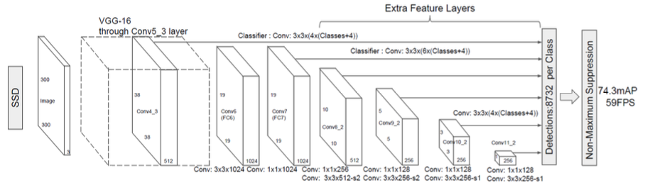
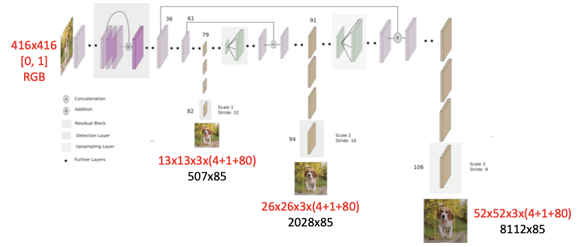
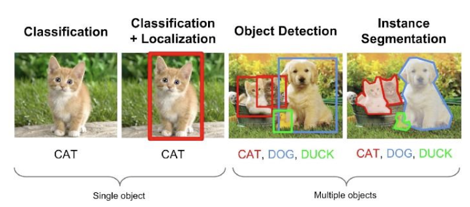
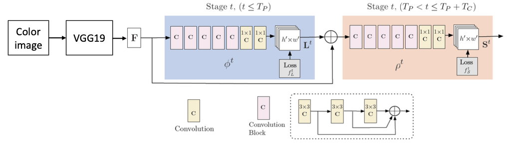
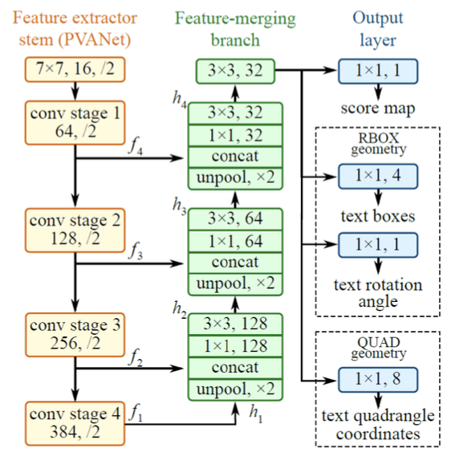
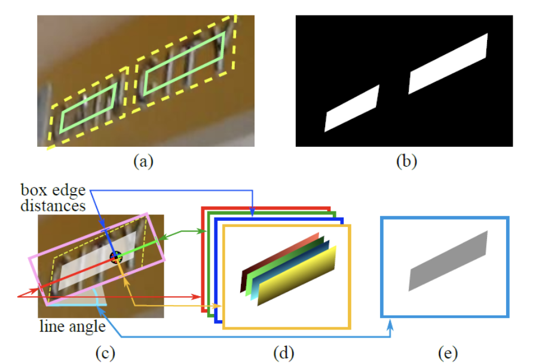

# 12. 딥러닝 활용. 객체 검출, 포즈 인식

## 1. OpenCV DNN 얼굴 검출
>SSD(Single Shot MultiBox Detector) 기반 얼굴 검출 네트워크 [링크](https://github.com/opencv/opencv/tree/master/samples/dnn/face_detector)  
> 기존의 `Haar-Cascade` 방법보다 속도 & 정확도 면에서 더 좋은 성능을 보여준다.  

* SSD(Single Shot MultiBox Detector) (W. Liu, et. al, 2016)
	동시대 다른 객체 검출 알고리즘과 비교하여 성능과 속도 두 가지를 모두 만족시킴. [관련 논문](https://arxiv.org/pdf/1512.02325.pdf).  
	.  
	입력 :  
	`size=(300,300)` , `scale= 1[0,255]` , `Mean=(104,177,123)` , `RGB=False`  
	출력 :  
	`out.shape=(1,1,N,7)` -> 뒤 두개만 필요`detect=out[0,0,:,:]`.  
	`detect[0,:] = [0,1,c,x1,y1,x2,y2]`  
	`c = 확률` , `x1,y1 = 좌상단` `x2,y2 = 우하단` . 좌표는 [0,1]로 정규화되어있기때문에 복원(frame 크기만큼 곱해줘)해서 써야된다.  
	 
## 2. YOLO 객체 검출
> You Only Look Once , 실시간 객체 검출 알고리즘. [사이트](https://pjreddie.com/darknet/yolo)

* YOLOv3 
	2018년 4월에 발표된 [Tech Report](https://pjreddie.com/darknet/yolo/)  
	기존 객체 검출 방법과 성능은 비슷하고 **속도는 훨씬 빠르다.**  
	[COCO 데이터셋](https://cocodataset.org) 사용(80개 클래스 객체 검출)  
	.  
	입력 :  
	`size` : `(320,320)` / `(416,416)` / `(608,608)` , 속도-정확도 trade-off.  
	`scale= 1/255.` , `Mean=(0,0,0)` , `RGB=True`.  
	출력 :  
	3개의 출력 레이어.  
	`outs[0].shape=(507,85)` / `outs[1].shape=(2028,85)` / `outs[1].shape=(8112,85)`.  
	`outs[0][0,:] = [tx,ty,tw,th,p,p1...p80]`.  
	`tx,ty,tw,th` : 바운딩 박스의 중앙, 크기. `p` : 확률.  `p1-p80` : 클래스 스코어.  
	 

* 출력 레이어 받아오기.
	```python
	# 출력 레이어 이름 받아오기
	layerName = net.getLayerNames()
	outLayer = [layerName[i[0]-1] for i in net.getUnconnectedOutLayers()]
	#outLayer = ['yolo_82', 'yolo_94', 'yolo_106']
	#(중략)
	outs = net.forward(outLayer)
	# outs 는 82,94,106번째 레이어를 같게 된다.
	```
* 비최대 억제(NMS, Non-Maximum Suppression)  
	바운딩 박스의 겹치는 정도를 가지고 지역을 설정. 이후 score_thre 를 통해 값을 확인.  
	`cv2.dnn.NMSBoxes(bboxes, scores, score_threshold, nms_threshold) -> retval`.  
	`bboxes` : 바운딩 박스 정보 리스트.  
	`scores` : 스코어 리스트.  
	`score_thre` : 스코어 >= thre.  
	`nms_thre` : 바운딩 박스 겹치는 정도.  -> 지역 선정.  
	`retval` : 선별 인덱스. `shape=(N,1)`.  

* 연산 시간 측정  
	`cv2.dnn_Net.getPerfProfile() -> retval, timings`.  
	`retval` : 시간.
	`timings` : Layer 별 시간.
	```python
	# 사용 예제
	t, _ = net.getPerfProfile()
	times = (t * 1000.0 / cv2.getTickFrequency()) 
	```
> outs 에 대한 후처리를 잘해줘야 한다.  

## 3. Mask-RCNN 영역 분할

* 영역 분할
	객체의 바운딩 박스 + 픽셀 단위 클래스 분류까지. -> 객체 윤곽 구분.  
	Semantic segmentation : 하나의 클래스는 모두 같은 레이블  
	Instance segmentation : 객체 단위 다른 레이블 [참고](https://medium.com/zylapp/review-of-deep-learning-algorithms-for-object-detection-c1f3d437b852)  
	.  

* Mask-RCNN
	대표적인 객체 영역 분할 딥러닝 알고리즘 (He et. al. 2017).  
	Faster R-CNN (object detection) + FCN (semantic segmentation).  
	[자세한 내용은 논문 참고](https://arxiv.org/pdf/1703.06870.pdf)  

	입력 :  
	`size = 임의(auto resize)`, `scale= 1` , `Mean=(0,0,0)` , `RGB=True`.  
	출력 :  
	2개의 출력 레이어.  
	`detection_out_final` -> `shape=(1,1,100,7)`.  
	=> `[0,classid,conf,x1,y1,x2,y2]`.  
	`detection_masks` -> `shape=(100,90,15,15)`.  
	=> 15 x 15 크기의 마스크.  

> 마스크 영역을 표시해줄 때, 실제 이미지 크기로 마스크를 리사이즈 후 표시해주어야 한다.!!!

## 4. OpenPose 포즈 인식

* OpenPose.  
	카네기 멜론 대학에서 만든 딥러닝 기반 동작 인식 라이브러리(CVPR, 2017). [링크](https://github.com/CMU-Perceptual-Computing-Lab/openpose).  
	사람의 몸, 손, 얼굴, 발, 관절(keypoints) 를 나타낸다.  
	구조. [자세한 내용은 논문 참고](https://arxiv.org/pdf/1812.08008.pdf)
	.  
	`F` : Feature map.  
	`L` : Set of 2D vector fields of part affinity(limb). 
	`S` : Set of 2D confidence maps of body part locations.  
	`L` 과 `S ` 에 관한 히트맵을 주고 이를 가지고 원하는 포인트를 찾으면 된다.  
		
	학습 데이터 셋 : 18개의 사람의 부분 점을 나타낸 COCO
	입력 :  
	`size` : `(368,368)` `scale= 1/255.` , `Mean=(0,0,0)` , `RGB=False`.  
	출력 :   
	`out.shape=(1,57.46.46)` : 46 x 46 크기의 히스맵.  
	`57` : 18(Keypoint Confidence Maps) + 1(background) + 19*2(Part Affinity Maps).  

* 검출 결과 영상 만들기.  
	출력 레이어의 각 포지션 별 히트맵의 최대값을 찾아 저장.  이후 다른 관절? 과의 관계를 확인해서 그려주면 된다.  
	사람이 한명일 경우 `out[0,:18,:,:]` 만 이용해서 그려주어도 된다.  

> 학습 데이터 셋에서 어느 위치에 넘버링을 했는 지 확인하고 그려주는게 중요하다.  
> 이 역시 학습보다는 학습 결과를 시각화할 때 잘해주어야 한다.  

## 5. EAST 문자 영역 검출

*  EAST  
	Efficient and Accurate Scene Text Detector(CVPR, 2017).  
	[소스코드](https://github.com/argman/EAST) , [논문](https://arxiv.org/abs/1704.03155v2).  
	.  
	
	입력 :  
	`size` : `(320,320)` `scale= 1` , `Mean=(123.68,116.78,103.94)` , `RGB=False`.  
	출력 :  
	2개의 출력 레이어.  
		`feature_fusion/concat_3` -> `shape=(1,5,80,80)`.  아래사진에서(c)
	=> 바운딩 박스의 점으로 부터 각 모서리까지의 거리(4) + 회전각(1).   
	`feature_fusion/Conv_7/Sigmoid` -> `shape=(1,1,80,80)`. 아래사진에서(b)
	=> 80 x 80 크기의 텍스트 영역 마스크.  
	.  
	
	두 레이어의 정보를 가지고  텍스트 영역을 crop하는데, 전부다 하는게 아닌 `비최대억제` 방법을 사용해서  텍스트 영역을 검출하면 된다.  [decode 함수 참고](./5_east.py)

## 6. 실습(실시간 얼굴 인식)
> 얼굴 이미지를 학습 시킨 모델을 가지고 진행.  
> SSD 로 얼굴을 검출한 후 학습 모델을 가지고 해당 얼굴이 누구인지 인식+라벨.  

* 모델 학습 
	[face_rec](./face_rec) 폴더의 코드 참고.  
	`face_capture.py` :  영상에서 얼굴을 검출 후 이미지로 저장.  
	`face_rec_train.py` : 라벨링된 이미지를 가지고 학습을 시켜 모델 생성.  


### 모델 파일 다운로드 링크

* 얼굴 검출.  
	모델 파일 :   
	[Caffe(FP16)](https://raw.githubusercontent.com/opencv/opencv_3rdparty/dnn_samples_face_detector_20180205_fp16/res10_300x300_ssd_iter_140000_fp16.caffemodel) / [TensorFlow(uint8)](https://raw.githubusercontent.com/opencv/opencv_3rdparty/dnn_samples_face_detector_20180220_uint8/opencv_face_detector_uint8.pb).  
	구성 파일 : [맞는거 쓰세요](https://github.com/opencv/opencv/tree/master/samples/dnn/face_detector).  

* YOLOv3.  
	모델 파일 : [yolov3.weight](https://pjreddie.com/media/files/yolov3.weights).  
	설정 파일 : [yolov3.cfg](https://github.com/pjreddie/darknet/blob/master/cfg/yolov3.cfg).  
	클래스 이름 : [voc_names](https://github.com/pjreddie/darknet/blob/master/data/voc.names).  

* Mask-RCNN.  
	모델 파일 : [mask_rcnn~.pb](http://download.tensorflow.org/models/object_detection/mask_rcnn_inception_v2_coco_2018_01_28.tar.gz).  
	설정 파일 : [mask_rcnn~.pbtxt](https://github.com/opencv/opencv_extra/blob/master/testdata/dnn/mask_rcnn_inception_v2_coco_2018_01_28.pbtxt).  
	클래스 이름 : [coco_90.names](https://github.com/amikelive/coco-labels).  

* OpenPose(COCO,18parts).  
	모델 파일 : [pose_~.caffemodel](http://posefs1.perception.cs.cmu.edu/OpenPose/models/pose/coco/pose_iter_440000.caffemodel).  
	설정 파일 : [pose_~.pbtxt](https://github.com/CMU-Perceptual-Computing-Lab/openpose/blob/master/models/pose/coco/pose_deploy_linevec.prototxt).  

* EAST 모델 :
	모델 파일 : [frozen_~.pb](https://www.dropbox.com/s/r2ingd0l3zt8hxs/frozen_east_text_detection.tar.gz?dl=1).  
	설정 파일 : 없음.  
