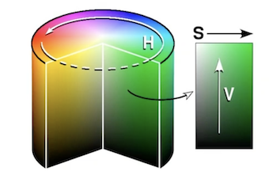
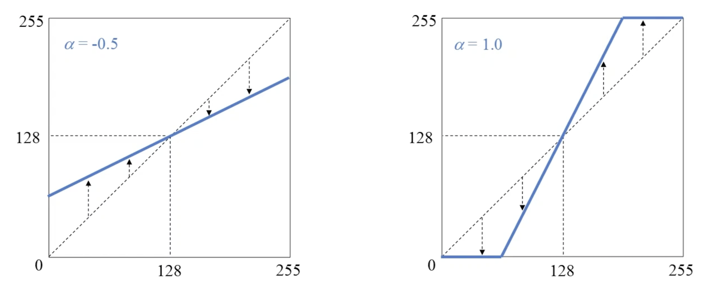

# 영상처리기법
## 1. 밝기 조절
화소처리 : 입력 영상의 특정 좌표 픽셀 값을 변경하여 출력 영상의 해당 좌표 픽셀 값으로 설정하는 연산 
`dst(x,y) = src(x,y) + n` 


범위가 [0,255] 벗어나게 되면 알아서 맞춰주는 연산(Saturate 연산)
`dst(x,y) = saturate(src(x,y)+n)`
```python 
	# add 함수 사용해서 밝기 조절.
	cv2.add(src1,src2,dst=None, mask=None, dtype=None) -> dst
	# numpy.clip 함수 사용
	np.clip(src+100.,0,255).astype(np.uint8)
```
`src1 , src2` : 영상 or 스칼라(B,G,R,C) 
`mask` : 마스크 영상
`dtype` : opencv 에서 지원하는 dtype. -> cv2.CV_8U
 grayscale 에 경우 `cv2.add(src,100)` .
 color 에 경우 `cv2.add(src,(100,100,100,0))` 과 같이 B,G,R 모두 더해줘야된다.
 
 np.clip 에 경우 src 에 더해줄때 float 으로 더해준다. 이후 타입 변환까지 해주면 된다.

## 2. 산술&논리 연산
### 2.1 산술 연산
* 덧셈
`dst(x,y) = saturate(src1(x,y) + src2(x,y))`
밝기 조절 때 사용한 `cv2.add` 함수 사용하면 된다.
* 가중치합
`dst(x,y) = saturate(\alpha src1(x,y) + \beta src2(x,y))`
	\alpha + \beta = 1 이 되도록 설정 => 두 입력 영상의 평균 밝기를 유지
	\alpha = \beta = 0.5 => 평균 연산 
	디졸브 효과를 줄 수 있다.
	```python	
		# addWeighted 함수 지원.
		# gamma 결과영상에 추가적으로 더할 값. 제외 전부 같음.
		cv2.addWeighted(src1, alpha, src2, beta, gamma, dst=None, dtye = None) -> dst
	```
* 뺄셈
	`dst(x,y) = saturate(src1(x,y) - src2(x,y))`
	아래와 같은 작업이 가능하다. 
	
	```python
		# 인자는 add 함수와 같다.
		cv2.substract(src1,src2, ...) -> dst
	```
*	차이 연산
	특정 영상에서 차이점(~~있었는데 없어졌습니다~~) 추출.
	src1 과 src2 의 순서가 상관없다.
	```python
		cv2.absdiff(src1,src2) -> dst
	```
> 특정 영상 간에 연산 시 결과를 예측할 수 있어야 한다.

### 2.2. 논리연산
잘 사용되지 않기 때문에 '논리 연산이 있다' 정도로만 넘어가도 좋다.
사용 시에 그 때 들여다 봐라 
```python
	cv2.bitwise_and(src1,src2,dst=None,maks=None) -> dst
	cv2.bitwise_or(src1,src2,dst=None,maks=None) -> dst
	cv2.bitwise_xor(src1,src2,dst=None,maks=None) -> dst
	cv2.bitwise_not(src1,src2,dst=None,maks=None) -> dst
```

## 3. 컬러 영상과 색 공간
컬러 영상은 3차원 `np.ndarray` 로 표현. `image.shape = (h,w,3)`
RGB 순서가 아닌 BGR 순서를 기본으로 사용.

컬러 영상을 각 채널로 분리가 가능하다. -> grayscale로 볼 수 있다.
```python
	# 채널 분리
	cv2.split(m, mv=None) -> dst
	# 채널 결합
	cv2.merge(mv, dst=None) -> dst
```
특정 작업을 할 때는 RGB 보다는 Gray,HSV,YCrCb 와 같은 색 공간으로 변환하여 사용한다.
```python
	# 색 공간 변환
	cv2.cvtColor(src,code,dst=None,dstCn=None) -> dst
```
`code` : 색 변환 코드, 예) cv2.COLOR_BGR2GRAY , [OpenCV 문서 참고](https://docs.opencv.org/3.4/d8/d01/group__imgproc__color__conversions.html)
* GrayScale
	RGB to Gray : `Y = 0.299R + 0.587G + 0.114B`  식으로 변환. 녹색 성분이 제일 큰 비중.
	용량 줄고 속도 빠름. But 색상 정보 손실
* HSV 색 공간
	Hue(색상) / Saturation(채도) / Value(명도) 
	 	  
	cv2.CV_8U 영상의 경우 
	* 0 <= H <= 179
	* 0 <= S <= 255
	* 0 <= V <= 255
* YCrCb 색 공간
	Y(밝기) / Cr,Cb(색차)
	사람이 인지하는 방식으로 구현된 색 공간.
	영상의 밝기 정보와 색상 정보를 따로 분리하여 부호화(흑백 TV호환)
	cv2.CV_8U 영상의 경우 
	* 0 <= H <= 255
	* 0 <= S <= 255
	* 0 <= V <= 255

## 4. 히스토그램
영상의 픽셀 값 분포를 그래프의 형태로 표현한것.
정규화된 히스토그램 : 전체 픽셀 개수로 나눠줌 -> 픽셀이 나타날 확률이 된다.
>히스토그램을 보고 밝기, 명암 정보 등을 알아 낼 수 있다.

```python
	cv2.calcHist(images, channels, mask, histSize, ranges,
				hist=None, accumulate=None) -> dist
```
`images` : 입력 영상 리스트(하나의 영상이여도 리스트 형태로 줘야한다.)
`channels` : hist 구할 채널 리스트
`histSize` : bin 개수
`range` : 각 차원 최소,최대.

## 5. 명암비
명암비(Contrast) : 밝은 곳과 어두은 곳 사이에 드러나는 밝기 정도의 차이

기본적인 조절 함수 : `dst(x,y) = saturate(s * src(x,y))` => 밝기 문제.
효과적인 명암비 조절 함수  : `dst(x,y) = saturate((1+\alpha)src(x,y) - 128\alpha)`

대부분의 영상에서 효과적으로 작용. but 모든 영상에 대해서 그런것은 아님, 정도는 아님.

### 5.1 히스토그램 스트레칭
영상의 히스토그램이 grayscale 전 구간에 걸쳐 나타나도록 변경하는 선형 변환 기법
```python
	# normalize 함수 사용
	cv2.normalize(src,dst,alpha=None,beta=None,norm_type=None,
				  dtype=None, mask=None) -> dst
	# 변환 함수 구하기(직선의 방정식)
	g(x,y) = (f(x,y) - Gmin) / (Gmax - Gmin)) * 255 
```
`alpha,beta` : 최소,최대 값
`norm_type` : 정규화 타입. NORM_L1, NORM_MINMAX . -> 여긴 minmax 사용.

### 5.2 히스토그램 평활화
히스토그램 스트레칭 과는 다른 방법.
정규화된 히스토그램 함수에서 누적 분포 함수를 구한 후 반올림 해준다.(말로하니 헷갈림)
`dst(x,y) = round(cdf(src(x,y)) * Lmax)` 

```python
	# 평활화 함수
	cv2.equalizeHist(src,dst=None) -> dst
	# src 는 grayscale만 가능.
```
* 히스토그램 스트레칭 VS 히스토그램 평활화

스트레칭 시 히스토그램 간격이 일정하게 적용.
평활화 시 간격이 다름. 
-> 보기에 따라 좋고 나쁨이 존재.(케바케)

 * Color 영상은 어떻게 해야할까?
	 color -> YCrCb 로 변환. 이후 밝기 정보를 가지고 있는 Y 채널에만 적용.
	 이후 다시 BGR 로 변환해줘야 `imshow` 에서 제대로 출력이 된다.
	
## 6. 특정 색상 영역 추출
RGB 색 공간보다는 HSV 색 공간에서 색상 영역 추출을 선호한다. -> 밝기 정보를 고려하지 않을 수 있다. => 이미지가 어둡거나 밝거나 상관없다. 
예) 녹색 : 50 < H < 80 / 150 < S < 255 / 0 < V < 255. 
빨강에 경우 '0에 가까운 값' 과 '179에 가까운 값'  을 찾아 논리 연산으로 붙여주어야 한다,
```python
	cv2.inRange(src,lowerb,upperb, dst=None) -> dst
```
`lowerb, upperb` : [lowerb,upperb]. 행렬 or 튜플

## 7. 히스토그램 역투영
영상의 각 픽셀이 주어진 히스토그램 모델과 얼마나 일치하는지 검사하는 방법.
임의의 색상 영역(YCrCb 색 공간 선호)을 검출할 때 효과적이다.
```python
	# 역투영 함수
	# 입력된 히스토그램을 가지고 역투영함.
	cv2.calcBackProject(images,channels,hist,ranges,
						scale,dst=None) -> dst
```
`cv2.log(src)` : log 스케일 함수. 차이가 급격할 경우 사용.

## 8. 실습
크로마키 영상을 가지고 배경 합성해보기

1. 크로마키 영상을 `HSV` 로 변환 
2. `inRange` 함수 사용해서 녹색 영역의 마스크 영상 생성
3. `copyTo` 함수 사용해서 마스크 영역에 배경 합성.
4. `waitKey` 에서 키보드 이벤트 처리 -> 스페이스바(합성) , ESC(종료)
