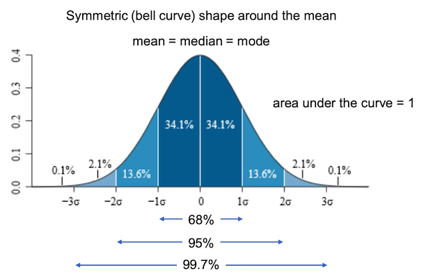

# 필터링
* 영상에서 필요한 정보만 통과시키고 원치 않는 정보는 걸러내는 작업.
2가지 접근법이 존재한다.
	1. 주파수 공간에서의 필터링(Frequency domain filtering)
	영상을 주파수 공간으로 전환 후 진행. 수학 모델에 대한 이해가 필요하다.
	2. 공간적 필터링(Spatial domain filtering)
	영상의 픽셀 값을 직접 이용하는 필터링 방법.
	주로 `mask(kernel)연산` 을 이용한다.
	OpenCV에선 효율성을 위해 주파수 공간에서도 작업 할 수 있음.

* 마스크 연산
	다양한 모양의 크기의 마스크가 있지만, 주로 `3 * 3 mask` 사용.
	형태와 값에 따라 필터의 역할이 결정된다.(부드럽게, 엣지 검출,잡음 제거 등)
	
	
	=> Correlation(convolution)
	
	최외각 픽셀 처리 : 가상의 픽셀이 있다고 가정. OpenCv default  는 대칭.
	
	

* 기본적인 2D 필터링
	```python
		cv2.filter2D(src,ddepth,kernel, dst=None, anchodr=None,
					 delta=None, borderType=None) -> dst 
	```
	`ddepth` : 출력 영상 데이터 타입. -1 지정시 src 와 같은 타입.
	`kernel` : mask

## 1. 블러링
### 1.1 평균값 필터(Mean Filter)
영상의 특정 좌표 값 = 주변 픽셀 값들의 산술 평균으로 설정.
픽셀들 간의 grayscale 값 변화가 줄어들어 엣지 무뎌지고 잡음이 사라진다.
-> 마스크 크기를 키우면 더 넓은 면적에 효과가 적용 + 연산량 커짐.


```python
	# cv2.filter2D 사용
	kernel = np.ones((3,3),dtype=np.float32) / 9.
	dst = cv2.filter2D(src,-1,kernel)
	# cv2.blur 함수
	dst = cv2.blur(src,(3,3))
```
`cv2.blur` 함수의 경우 구현이 쉽다 But 가중치가 동일. -> 효과가 적음.
=> 평균값 필터 대신 가우시안 필터를 적용.

### 1.2 가우시안 필터(Gaussian Filter)
가까운 픽셀은 큰 가중치, 멀리 있는 픽셀은 작은 가중치를 사용하여 평균 계산.
-> 가우시안 함수(Gaussian function, 정규분포) 를 사용한다.
평균을 항상 0 으로 잡고, 표준 편차를 이용한다.
 

대부분의 값이 3\sigma 에 포함되기 때문에 필터마스크 크기를 (8\sigma+1) or (6\sigma+1) 을 사용한다.
```python
cv2.GaussianBlur(src,ksize,sigmaX,dst=None, sigmaY=None,
					 borderType=None) -> dst
```
`ksize` : 가우시안 커널 크기. -> (0,0) 이면 simga 값에 의해 자동 결정됨. (권장)
`sigmaX` : x 방향 sigma.
`sigmaY` : y 방향 sigma. 0 이면 x 와 같음.

## 2. 샤프닝
### 언샤프 마스크(Unsharp mask) 필터링
날카롭지 않은 영상, 즉 부드러워진 영상을 이용하여 날카로운 영상을 생성.
 

`blur` 를 통해 부드러워진 영상을 기존 영상에서 빼준다. -> 날카로워진 부분만 남음.
그 부분을 기존 영상에 더해주면 더욱 날카로운 영상이 탄생! (위 함수 설명임)
```python
	# addWeight 함수 사용
	cv2.addWeighted(src,2,blr,-1,0)
	# np.clip
	np.clip(2.0 * src - blr, 0, 255).astype(np.uint8)
```
샤프닝 정도를 조절할 수 있도록 수식 변경 : `h(x,y) = f(x,y) + \alpha * g(x,y)` 
컬러 영상에 경우 YCrCb 로 변환 후 Y 만 연산.
> tip! 연산 시에는 실수로 진행하고 , 결과를 np.uint8 로 저장하는 게 정확성을 높여준다.

## 3. 잡음 제거
영상의 잡음(Noise) : 영상의 픽셀 값에 추가되는 원치 않는 형태의 신호
종류 : 소금-후추 잡음(요샌 거의X, 아날로그 통신), 가우시안 잡음(어두 or 밝) 

### 3.1 미디언 필터(Median Filter)
주변 픽셀들의 값들을 정렬하여 그 중앙값으로 픽셀 값을 대체.
소금-후추 잡음 제거에 효과적. -> 요샌 잘 안씀. + 아이디어 정도로 알고 넘어가자.
```python
	cv2.medianBlur(src,ksize,dst=None) -> dst
```
`ksize` : 정수 -> (n * n)
픽셀 값들이 뭉치는?뭉개지는? 느낌이 듬. -> 좋은 성능을 보이진 않는다.

### 3.2 양방향 필터(Bilateral Filter)
가우시안 잡음 제거에는 가우시안 필터가 효과적이다. => 활용해 만든게 양방향 필터
엣지 보전 잡음 제거 필터의 하나.

$$ BF[I]_{p} =  {1 \over W} \sum\limits_{q \in S}G_{\sigma_{s}}(||p-q||)G_{\sigma_{r}}(|I_{p}-I_{q}|)I_q $$

$ G_{\sigma_s}(||p-q||) $ :기준 픽셀과 이웃 픽셀 거리

$ G_{\sigma_{r}}(|I_{p}-I_{q}|) $ : 픽셀 값의 차이.
즉, 기준 픽셀과 이웃 픽셀 거리와 픽셀 값의 차이를 고려. => 엣지가 아닌 부분에서만 블러링을 적용.
```python
cv2.bilateralFilter(src,d,sigmaColor,sigmaSpace,dst=None,
						borderType=None) -> dst
```
`d` : 이웃 픽셀 거리. -1 입력 시 sigmaSpace 값에 의해 자동 결정(권장)
`sigmaColor` : 색 공간에서 필터의 표준 편차. 엣지 구분. 너무 크게 잡으면 그냥 블러
`sigmaSpace` : 좌표 공간에서 필터의 표준 편차
모든 픽셀마다 필터를 만들어야 하기 때문에 연산 속도가 오래걸린다. -> 시그마 값 조절.


## 실습
카툰&스케치필터 적용하기.
* 카툰 필터 
	`bilateralFilter` bitwise_and  `Canny` -> 이미지 사이즈를 줄여서 하면 효과적이다.
* 스케치 필터
	`cvtColor(BGR2GRAY)` divide(scale=255) `GaussianBlur`
  
	   
