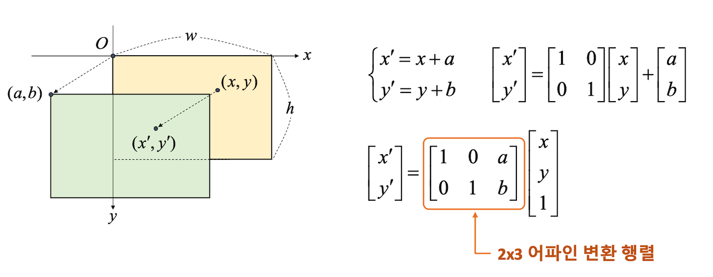
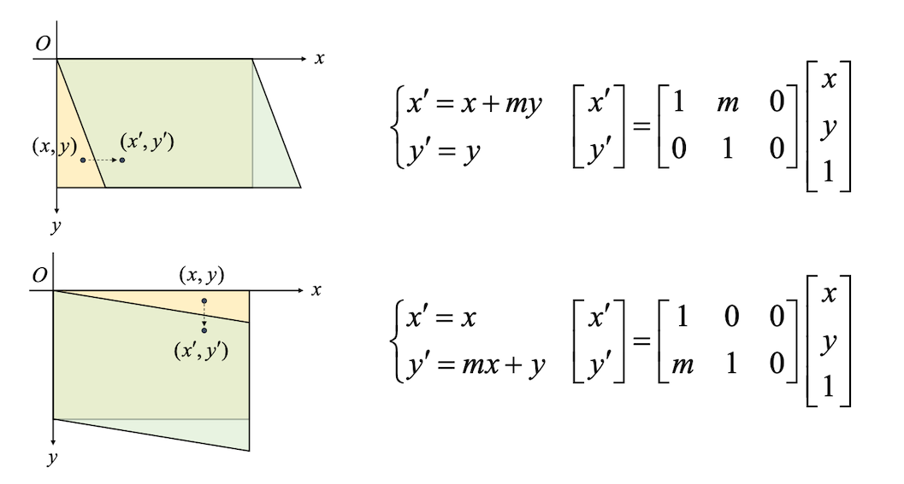
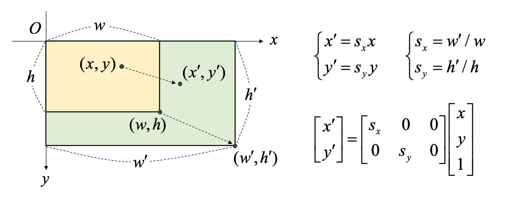
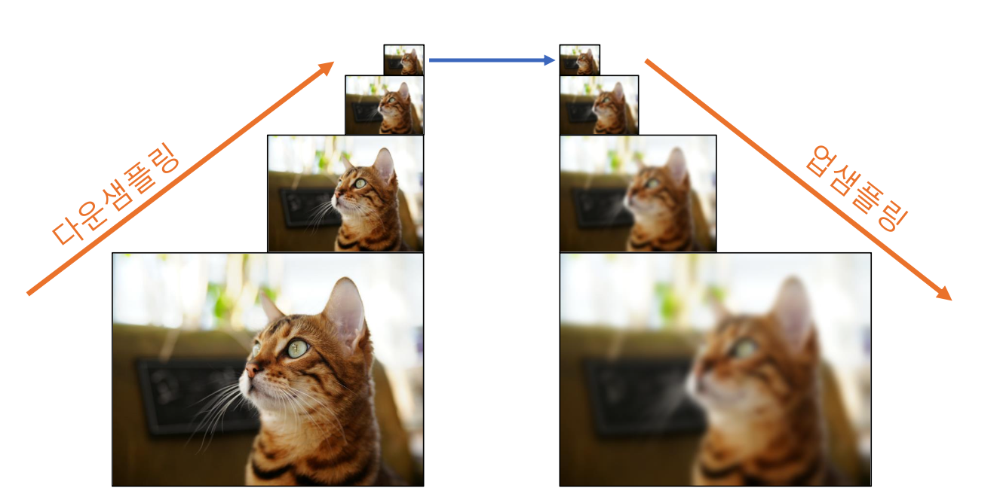
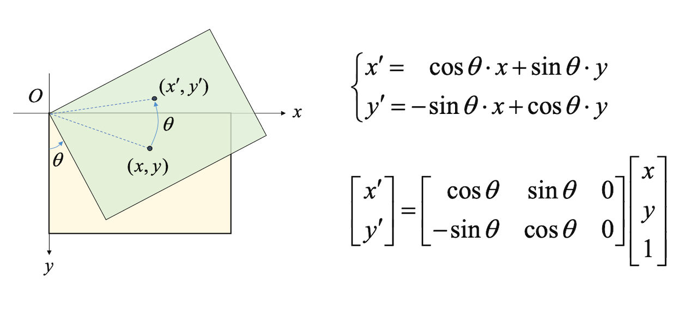
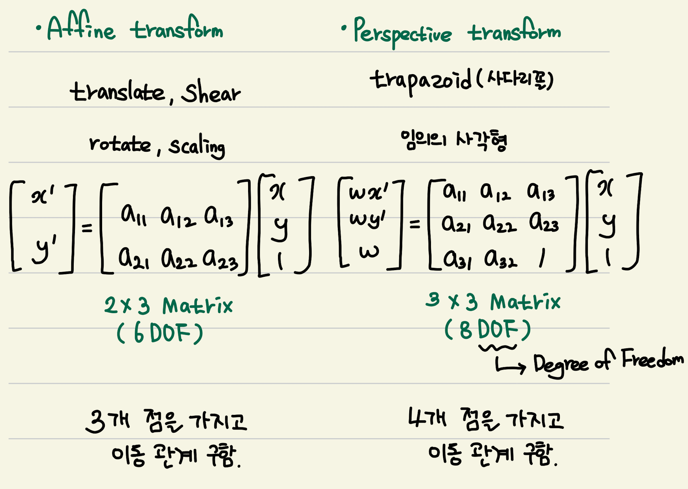

# 기하학적 변환

* 기하학적 변환(geometric transformation) 
	영상을 구성하는 픽셀의 배치 구조를 변경함으로써 전체 영상의 모양을 바꾸는 작업.

## 1. 이동 변환과 전단 변환
### 1.1 이동변환
가로 또는 세로 방향으로 영상을 특정 크기만큼 이동시키는 변환.
x,y축 방향으로의 이동 변위 지정.


### 1.2 전단 변환
층 밀림 변환.  x,y축 방향 따로 정의.


두 변환 모두 `cv2.warpAffine` 함수 이용.
```python
cv2.warpAffine(src,M,dsize,dst=None, flags=None,borderMode=None,borderValue=None) -> dst
```
`M` : 2x3 어파인 변환 행렬. 실수형
`dsize` : 결과 영상 크기, (w,h). (0,0) 시 입력 영상과 같은 크기
`flags` : 보간법. 

변환 이후 전체모습을 보기 원하면 `dsize` 를 적절히 조절해주면된다.
```python
M = np.array([[1,0.5,0],
			  [0,1,,0]],dtype=np.float32)
dst = cv2.warpAffine(src,M,(w+int(h*0.5),h))
```

## 2. 영상의 확대 축소
### 2.1 크기 변환
x,y 축 방향으로의 스케일 비율 지정.


`cv2.warpAffine` 도 있지만 `cv2.resize`  지원.
```python
cv2.resize(src,dsize,dst=None,fx=None,fy=None,interpolation=None) -> dst
```
`dsize` : (w,h) 튜플, (0,0) 시 fx,fy 값 사용해 결정.
`fx,fy` : x,y방향 스케일 비율
`interpolation` : 보간법. default 인 cv2.INTER_LINEAR(2x2 이웃픽셀참조) 가 가장 무난.

* 영상 축소 시 고려할 사항
디테일이 사라지는 경우가 발생. 
입력 영상을 부드럽게 필터링 한 후 축소, 단계별로 축소
`cv2.resize` 시 cv2.INTER_AREA 설정.

### 2.2 영상의 대칭
대칭의 경우 기존의 `warpAffine` 함수 가능하지만  `cv2.filp` 함수 지원.
```python
cv2.filp(src, flipCode, dst=None) -> dst
```
`flipCode` : 좌우(1) , 상하(0) , 상하좌우(-1)

## 3. 이미지 피라미드
하나의 영상에 대해 다양한 해상도의 영상 세트를 구성한 것.
보통 가우시안 블러링 & 다운샘플링 형태로 축소하여 구성.
-> 영상 내에서 원하는 객체를 찾기 위해 사용한다.


```python
cv2.pryDown(src,dst=None, dstsize=None, borderTpye=None) -> dst
cv2.pryUp(...) 
```
`dstsize` : 따로 지정하지 않으면 (w/2,h/2) 
5 x 5 크기 가우시안 필터 적용 후 짝수 행과열 제거하여 작은 크기 영상 생성.
> 많이 사용할 일 없다. 알고만 있읍시다.

## 4. 영상의 회전
영상을 특정 각도만큼 회전시키는 변환(**반시계 방향**)


`cv2.warpAffine` 함수 사용 시 회전 중심 : **좌측 상단**
영상의 중심을 기준으로 회전을 하고 싶으면 `cv2.getRotationMatrix2D` 사용.
```python
cv2.getRotationMatrix2D(center,angle,scale) -> retval
```
`center` : 회전 중심 좌표. (x,y) 튜플
`angle` : 회전 각도(degree), 반시계
`scale` : 추가 확대 비율
`retval` : **2 x 3 어파인 변환 행렬** -> 얘를 활용해 `cv2.warpAffine` 하면 된다.
-> `retval` 동작 원리 :   center 를 (0,0) 으로 이동 후 돌려 그리고 다시 제자리로.

## 5. 어파인 변환과 투시 변환


```python
# affine 변환은 3개의 점의 이동을 가지고 변환 행렬을 얻음
# perspective 변환은 4개의 점의 이동을 가지고 변환 행렬을 얻음. 
cv2.getAffineTrnasform(src,dst) -> retval
cv2.getPerspectiveTransform(src,dst) -> retval
```

## 6. 리매핑
특정 위치 픽셀을 다른 위치에 재배치하는 일반적인 프로세스
$dst(x,y) = src(map_x(x,y),map_y(x,y))$
-> 어파인, 투시 등 다양한 변환을 리매핑으로 표현 가능하다.(자유도가 높은 변환)
map_x = x - 200 , map_y = y - 100 => 이동변환

```python
cv2.remap(src,map1,map2,interpolation,dst=None,borderMode=None,borderValue=None) -> dst
```
`map1` : 결과영상의 (x,y) 좌표가 참조할 입력 영상의 x 좌표. np.float32
`map2` : 결과영상의 (x,y) 좌표가 참조할 입력 영상의 y 좌표. np.float32
-> `map1,map2` 얻는법 : `np.indices` 함수 이용해서 얻는다.

## 7. 실습
카메라로 촬영한 문서 영상을 똑바로 펴서 저장해주는 프로그램.
마우스 이벤트 처리를 통해 각 모서리 선택 후 왜곡된 영상을 직사각형 형태로 펴기.


