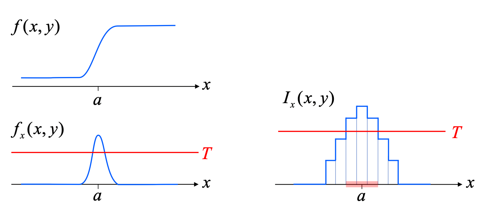
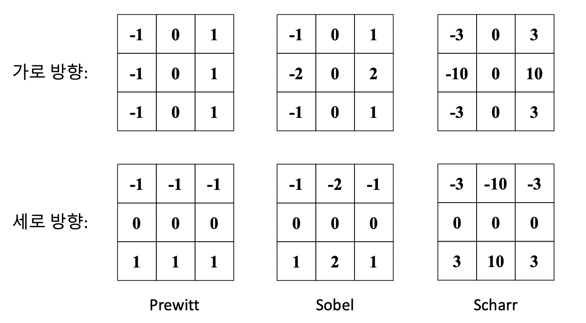
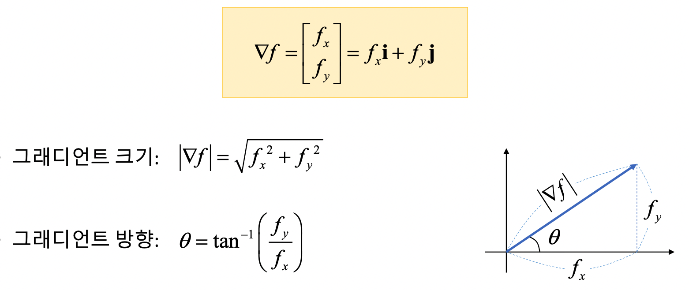
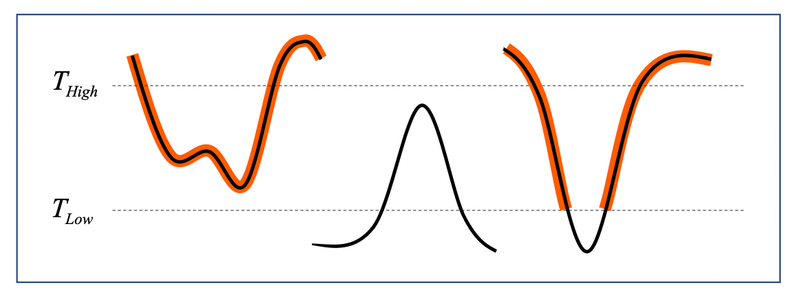
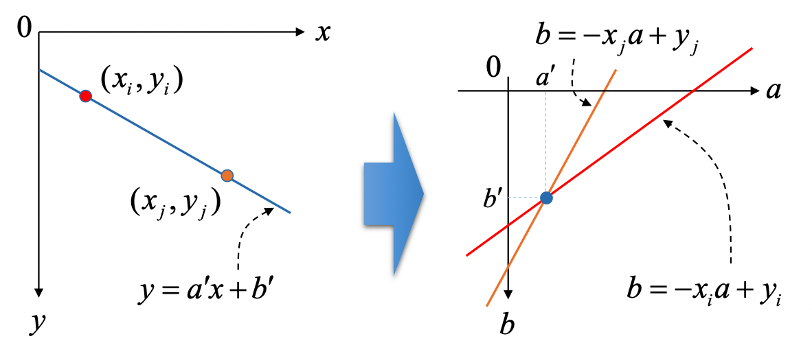
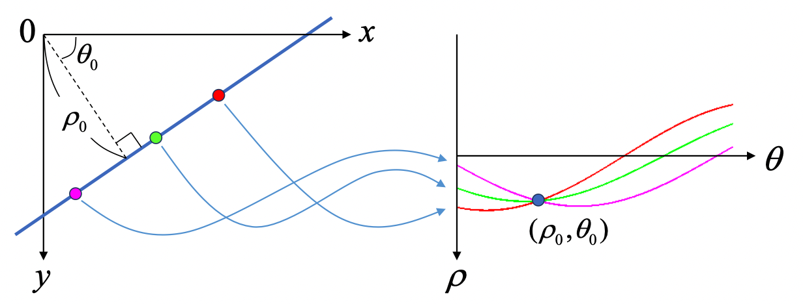

# 영상의 특징 추출

## 1. 영상의 미분과 소벨 필터 
* 엣지(edge) 
영상에서 픽셀의 밝기 값이 급격하게 변하는 부분
일반적으로 배경과 객체 또는 객체와 객체의 경계.
-> 영상을 (x,y) 변수의 함수로 간주했을 때 이 함수의 1차 미분 값이 큰 부분 검출.
	

	threshold 를 적절하게 지정해주는게 중요하다.(추후 설명)
	여러 미분 마스크가 있고, x,y 축 방향이 따로 존재한다.
	

```python
# 효과가 유의미한 차이가 있진않아서 소벨 필터를 주로 사용한다. 
# 소벨 필터
cv2.Sobel(src, ddepth, dx, dy, dst=None, ksize=None, scale=None, delta=None, borderType=None) -> dst
# 샤르 필터
cv2.Scharr( ... )
```
`ddepth` : 출력 영상 데이터 타입. -1이면 입력과 같음.
`dx,dy` : x방향, y방향 미분차수. 대부분(1,0) or (0,1)
`delta` : grayscale 에서 연산 시 128을 더해줘서 미분값의 증감을 눈으로 확인할수 있게 해줌.

> x축 미분 , y축 미분을 따로 하고 결과를 합쳐서 분석해야 한다. 

## 2. 그래디언트와 엣지 검출
* 그래디언트(gradient)
함수f(x,y)를 x축과 y축으로 각각 편미분하여 벡터형태로 표현한 것
 

	실제 영상에서 구한 그래디언트 크기와 방향.
	크기 : 픽셀 값의 차이 정도, 변화량. 
	방향 : 픽셀 값이 가장 급격하게 **증가**하는 방향.
	```python
	# 2D 벡터의 크기 계산 함수
	cv2.magnitude(x,y,magnitude=None) -> magnitude
	# 2D 벡터의 방향 계산 함수
	cv2.phase(x,y angle=None, angleInDegrees=None) -> angle
	```
	`소벨 필터` 를 통해 구한 `dx,dy` 를 이용해서 magnitude 를 계산하고 적절한 threshold 설정.

## 3. 캐니 엣지 검출
좋은 엣지 검출기의 조건(by 캐니) : 정확한 검출/정확한 위치/단일 엣지.
* 검출 단계
	1. 가우시안 필터링(optional)
	2. 그래디언트 계산(크기&방향)   
	3. 비최대 억제(Non-maximum suppression) 
	하나의 엣지가 하나의 픽셀로 표현되기 위해 국지적 최대인 픽셀만 엣지 픽셀로 설정.
	그래디언트 방향에 위치한 두 개의 픽셀을 검사.
	4. 히스테리시스 엣지 트래킹(Hysteresis edge tracking)
	두 개의 임계값을 사용 : $T_{Low}$, $T_{High}$
	강한 엣지 : $||f|| >= T_{High}$ -> 엣지임.
	약한 엣지 : $T_{Low} <= ||f||  <= T_{High}$ -> 강한 엣지와 연결된 픽셀만 엣지.
			
```python
cv2.Canny(image, thre1, thre2, edges=None, apertureSize=None, L2gradient=None) -> edges
```
`image` : 가급적이면 grayscale 로 변환해서 주는게 좋다.
`thre1,thre2` : 보통 1:2 or 1:3 이지만, 영상에 맞춰서 알아서 조절하세용.
`L2gradient` : True : L2 norm 사용. False : L1 norm 사용.

## 4. 허프 변환
### 4.1 직선 검출
허프 변환(Hough transform) 직선 검출 : 직선의 방정식을 파라미터 공간으로 변환하여 직선을 찾는 알고리즘.


직선의 방정식을 파라미터 공간으로 변환하게 되면 각 점들이 직선으로 됨. 
-> 해당 직선 성분과 관련있는 원소 값을 1씩 증가시키는 배열을 **축적 배열** 이라 함.

$y=ax+b$ 은 y축과 평행한 수직선은 표현하지 못한다는 문제점이 있다. -> 극좌표계 직선의 방정식($x\cos\theta+y\sin\theta = \rho$) 사용.


```python
# 허프 변환에 의한 선분 검출
cv2.HoughLines(image, rho, theta, threshold, lines=None, srn=None, stn=None, min_theta=None, max_theta=None) -> lines
# 확률적 허프 변환에 의한 선분 검출
cv2.HoughLinesP(image, rho, theta, threshold, lines=None, minLineLength=None, maxLineGap=None) -> lines
```
`image` : 입력 엣지 영상.
`rho` : 축적 배열의 rho 값의 간격(주로 1.0 -> 1픽셀 간격)
`theta` : 축적 배열의 theta 값의 간격(np.pi / 180 -> 1도 간격)
`lines` : 선분 시작,끝 좌표(x1,y1,x2,y2) shape=(N,1,4) -> 사용시 주의
`maxLineGap` : 직선으로 간주할 최대 엣지 점 간격(끊기는 부분을 고려해서 적절하게)

### 4.2 원 검출
허프 변환을 응용하여 원을 검출 할 수 있다. -> 원의 방정식을 3차원 축적 배열. (속도느려)
속도 향상을 위해 Hough gradient method 사용
* Hough gradient method 
	입력 영상과 동일한 2차원 평면 공간에서 축적 영상 생성.
	엣지 픽셀에서 그래디언트 계산 + 방향 따라서 직선그리면서 값 누적 => 중심 찾기. + 적절한 반지름 검출
	여러 개의 동심원을 검출 못한다 -> 가장 작은 원 하나만 검출됨.

```python
# 허프 변환 원 검출 함수
cv2.HoughCircles(image, method, dp, minDist, circles=None, param1=None, param2=None, minRadius=None, maxRadius=None) -> circles
```
`image` : 엣지 영상이 아닌 일반 영상
`method` : `cv.HOUGH_GRADIENT` `cv2.HOUGH_GARDIENT_ALT`
`dp` : 입력 영상과 축적 배열 크기 비열. 1 이면 동일 2면 반띵
`minDist` : 검출된 원 중심점들의 최소 거리
`circles` : (cx,cy,r) 정보. shape = (1,N,3).  *주의 직선이랑 다름.* 
 `param1` : Canny 엣지 검출기의 높은 임계값
 `param2` : 축적 배열에서 원 검출을 위한 임계값

* `cv.HOUGH_GRADIET` vs `cv.HOUGH_GRADIENT_ALT` 
	 OpenCV 4.3 버전부터 지원.
	 ALT 가 보다 정확한 원 검출 가능. -> 파라미터가 달라짐.			

## 5. 실습
동전 카운터 : 영상의 동전을 검출하여 금액이 얼마인지 자동 계산 프로그램.
구현할 기능 : 동전 검출(허프 원 검출) + 동전 구분(색상 정보)
* 동전 구분 :
	HSV 색 공간에서 Hue 값을 이용. -> 동전 영역 Hue 값 + 40 의 평균.
	-> 구리빛인 10원이 0 과 180 인근이기 때문에 평균하면 중간값이 나와버림.
	`cv2.mean(src,mask=None)` : 4개의 float 리스트. [0] 째 값이 mean 값.
