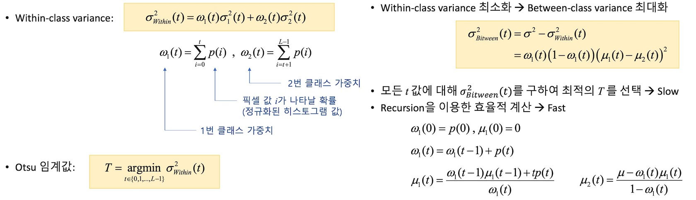
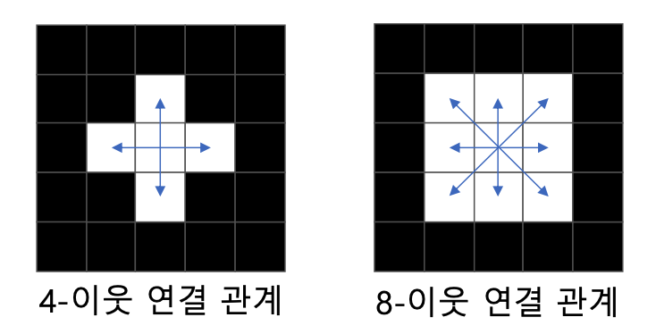
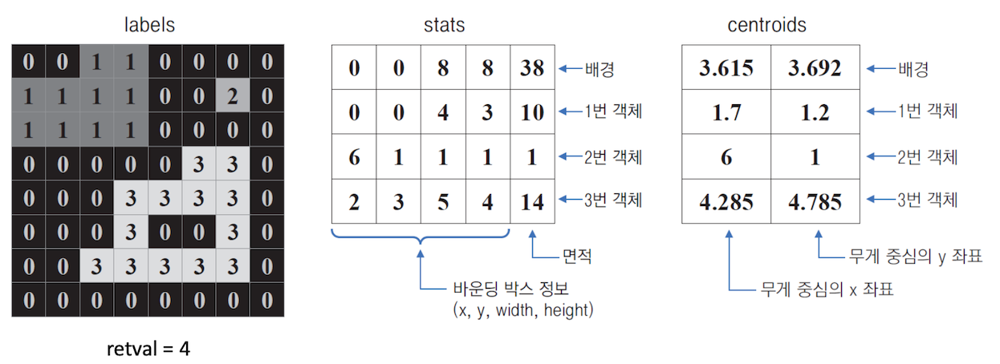
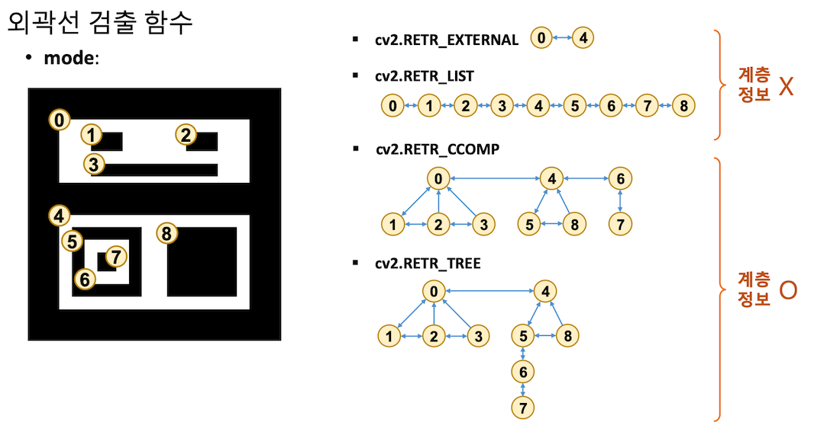
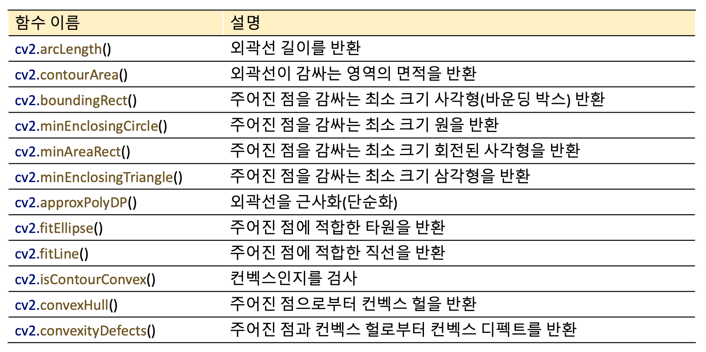

# 이진 영상 처리

## 1. 영상의 이진화
### 1.1 이진화
영상의 픽셀 값을 0 or 255 로 만드는 연산 -> 배경vs객체 / 관심영역 vs 비관심영역

* 그레이스케일 영상의 이진화
	threshold 를 기준으로 크면 0 작으면 255. -> threshold 설정을 적절히 하면된다.
	```python
	# 임계값 함수
	cv2.threshold(src, thresh, maxval, type, dst=None) -> retVal, dst
	```
	`thresh` : 사용자 지정 임계값
	`maxval` : 이진화 시 255.
	`type` : `cv2.THRESH_`로 시작하는 플래그. 함수동작 지정. 주로 `BINARY` , `BINARY_INV` 사용. 기타 [OpenCV공식문서 참고] (https://docs.opencv.org/4.5.0/d7/d1b/group__imgproc__misc.html#gae8a4a146d1ca78c626a53577199e9c57)
	`retVal` : 사용된 임계값
	
### 1.2 Otsu 이진화.
입력 영상이 배경과 객체 두 개로 구성되어 있다고 가정. -> Bimodal histogram
임계값 T 에 의해 나눠지는 두 픽셀 분포 그룹의 분산이 최소가 되는 T 를 선택
일종의 최적화 알고리즘.


점화식을 사용해서 보다 빠르게 작동한다. [자세한 수식은 여기!!](https://en.wikipedia.org/wiki/Otsu's_method)

### 1.3 지역 이진화
균일하지 않은 조명 환경에서 촬영된 영상의 이진화. 
해결방법 
1. 불균일한 조명 성분을 보상한 후 전역 이진화 수행 -> 쉽지 않음.
2. 픽셀 주변에 작은 윈도우를 설정하여 지역 이진화 수행
	윈도우의 크기/형태/Overlap/배경 또는 객체만 존재? 와 같은 점 고려해야된다. 

```python
# 직접 윈도우를 나눠서 이진화 수행.(local_th.py 참고)
# OpenCV 제공 함수 
cv2.adaptiveThreshold(src, maxValue, adaptiveMethod, thresholdType,
blockSize, C, dst=None) -> dst	
```
`adaptiveMethod` : 블록 평균 계산 방법 지정. `cv2.ADAPTIVE_THRESH_MEAN_C(산술평균)` , `cv2.ADAPTIVE_THRESH_GAUSSIAN_C(가우시안가중치평균)`
`blockSize` : 3 이상의 홀수. 꽤 커야 잘 동작한다.
`C` : 평균 값에서 뺄 값. (x,y) 픽셀의 임계값으로 $T(x,y) = \mu_B(x,y)-C$ 사용

블럭 사이즈가 작을 경우 -> 객체 or 배경만 있는 경우가 생긴다. -> 노이즈 발생.

>2가지 방법(직접 나누기/제공함수쓰기) 중 더 잘 동작하는 걸 선택해서 하면된다.(속도차이는 크게 나지않는다)

## 2. 모폴로지 
* 모폴로지(Morphology) 
	영상을 형태학적인 측면에서 다루는 기법.
	전처리 또는 후처리 형태로 널리 사용된다.
	구조 요소 : 연산 결과를 결정하는 커널, 마스크 => 필터 마스크와 유사하다.

### 2.1 침식 & 팽창 연산
* 침식(erosion) 연산
	구조요소가 객체영역 내부에 완전히 포함될 경우 고정점 픽셀을 255로 설정.
	객체 외각을 깍아내는 연산 -> 객체 크기가 감소 & 배경은 확대.
	작은 객체의 잡음 제거 효과
* 팽창(dilation) 연산
	구조요소가 객체영역 한 픽셀이라도 포함할 경우 고정점 픽셀을 255로 설정.
	객체 외각을 확대시키는 연산 -> 객체 크기가 확대 & 배경이 축소
	객체 내부 홀을 채워진다.

```python
# 침식 연산 함수
cv2.erode(src, kernel, dst=None, anchor=None, iterations=None, borderType=None, borderValue=None) -> dst
# 팽창 연산 함수
cv2.delate( ... ) 
# 모폴로지 구조 요소(커널) 생성
# 필요할 때만 생성해서 쓴다. 
getStructuringElement(shape,ksize,anchor=None) -> retval
```
`kerenl` : `None` 지정시 3 x 3 사각형 구성요소, `getStructuringElement()` 생성가능
`shape` : 모양 플래그. `cv2.MORPH_RECT(사각형)`,`cv2.MORPH_CROSS(십자가)` 등


### 2.2 열기 & 닫기 연산
* 열기(Opening) 연산
	침식 -> 팽창
	작은 돌기, 작은 객체 사라지고 얇은 연결선 끊어지는 효과.
	노이즈(작은 객체)를 제거하기 위해 많이 사용한다.
* 닫기(Closing) 연산 
	팽창 -> 침식
	작은 홈, 작은 홀이 사라지고 얇은 연결선이 두꺼워지는 효과

```python
# 범용 모폴로지 연산 함수
# 침식,팽창 등 다 됨.
cv2.morphologyEx(src, op, kernel, dst=None, ...) -> dst
```
`op` : 모폴로지 연산 플래그 `cv2.MORPH_ERODE` ,`cv2.MORPH_OPEN`. 등
 
## 3. 객체 단위 분석
객체(흰색)를 분할하여 특징을 분석.
객체 위치 및 크기 정보, ROI 추출, 모양 분석 등

### 3.1 레이블링
동일 객체에 속한 모든 픽셀에 고유한 번호를 매기는 작업
일반적으로 이진 영상에서 수행.
영상처리와 컴퓨터 비전에서 상당히 많이 사용되는 작업.
픽셀의 연결관계를 미리 지정해줘야한다.(OpenCV 에선 8-neightbor)

```python
# 레이블링 함수
cv2.connectedComponents(image, labels=None, connectivity=None, ltype=None) -> retval, labels
# 객체 정보를 함께 반환하는 레이블링 함수(선호)
cv2.connectedComponentsWithStats(image, ...) 
-> retval, labels, stats, centroids
```
`retval` : 객체 개수(배경포함) -> 실제 객체 수는 N-1개. 0이 배경을 의미.
`labels` : 레이블 맵 행렬. `np.ndarray`
`stats` : 각 객체 바운딩 박스 정보 담은 행렬. `shape = (N,5)`
`centroids` : 각 객체 무게 중심 위치 정보 담은 행렬. `shape = (N,2)`



>레이블링 함수를 직접 구현하는건 쉽지않음 -> 구현을 하는 것보다는 OpenCV 함수 쓰고, 나온 결과(레이블 맵)을 **어떻게 활용할 지**를 고민하는 게 중요하다.

### 3.2 외곽선 검출
* 외곽선 검출이란
	객체의 외곽선 좌표를 모두 추출하는 작업. Boundary tracking, Contour tracing
	바깥쪽 & 안쪽(홀) 외곽선 추출 가능 -> 외곽선 계층 구조 표현 가능

* 외곽선 객체 표현 방법
	`np.ndarray` , `shape=(K,1,2)` , `dtype=np.int32`K는 외곽선 좌표 개수
	여러 개 표현 시 리스트로 묶어준다. => 객체 하나의 외곽선을 원소로 갖는 리스트

```python
# 외곽선 검출 함수.
cv2.findContours(image, mode, method, contours=None, hierarchy=None, offset=None) -> contours, hierarchy
```
`mode` : 외곽선 검출 모드, 아래 사진 참고
`method` : 외곽선 근사 방법. 요새는 이후에 따로 작업(`cv2.CHAIN_APPROX_NONE` 쓰세요)
`contours` : 검출된 외곽선 좌표. `np.ndarray`로 구성된 리스트. 위에 설명.
`hierarchy` : 외곽선 계층 정보. `shape=(1,N,4)` 순서대로 `next`,`prev`,`child`,`parent`. 없으면 -1. 부모/자식은 대표 하나만 지정.



* 외곽선 그리기
```python
cv2.drawContours(image,contours,contourIdx,color,hierarchy=None, ...) -> image
```
`contourIdx` : 외곽선 인덱스, -1 이면 모든 외곽선 그림. 


### 3.3 다양한 외곽선 함수
 
[OpenCV 공식 문서 참고](https://docs.opencv.org/4.5.0/d3/dc0/group__imgproc__shape.html#ga8d26483c636be6b35c3ec6335798a47c)

* 다각형 검출 프로그램
	사용할 함수.(모든 입력은 외곽선 좌표임.`shape=(K,1,2)`
	```python
	cv2.arcLength(curve,closed) -> retval # 길이
	cv2.contourArea(contour,oriented)-> retval # 면적
	cv2.boundingRect(array) -> retval # 사각형 정보(x,y,w,h)
	cv2.minEnclosingCircle(array) -> centor, radius
	cv2.isContourConvex(contour) -> retval # T/F
	cv2.approxPolyDP(curve, epsilon, closed, pproxCurve=None) -> approxCurve 
	```
	`curve` : 입력 곡선 좌표 `shape=(K,1,2)`
	`epsilon` : 근사화 정밀 조절. 입력 곡선과 근사화 곡선 간 최대거리. 보통(외곽선 전체길이) * 0.02
	`approxCurve` : 근사화된 곡선 좌표
	[참고사항 더글라스-포이커 알고리즘](https://en.wikipedia.org/wiki/Ramer%E2%80%93Douglas%E2%80%93Peucker_algorithm)
	구현 순서
	이진화 - 외곽선 찾기 - 외곽선 근사화 - 너무 작은 객체와 컨벡 가 아닌 객체 제외 5)꼭지점 개수 확인(삼각형/사각형/원 검출)
	* 원 판별법 : 외곽선 길이에 대한 넓이의 비율이 1에 가까울 수록 원. 즉, $4\pi \frac {A}{P^2}$ 이 1에 가까우면 원.


## 4. 실습
`np.lexsort` : sequence key를 가지고 정렬. -> index 값을 리턴해준다.
**Tesseract**  : 광학 문자 인식(OCR) 라이브러리  -> 이미지에서 문자 인식해줌.
`pt[[a,b]]` : pt-> pt[a],pt[b] 출력. -> 이중배열 할때 유용하다.

