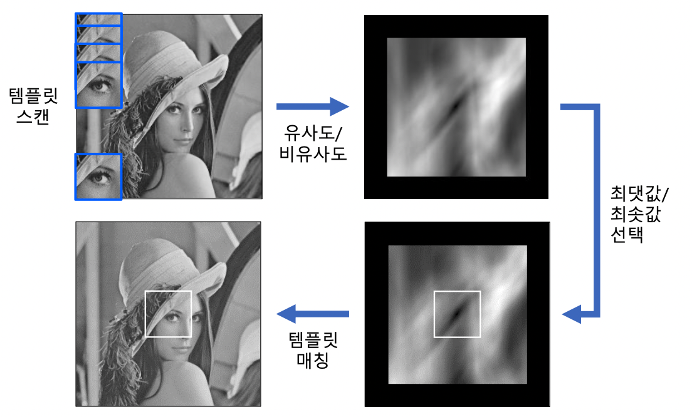
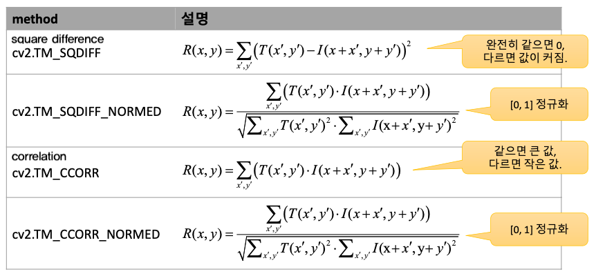
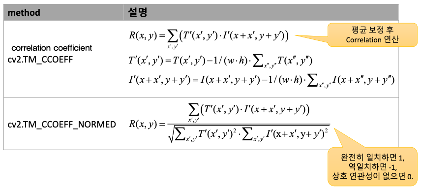
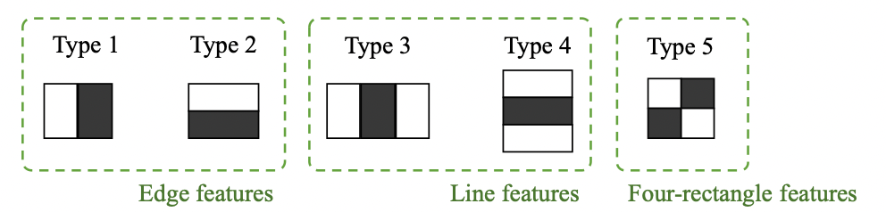
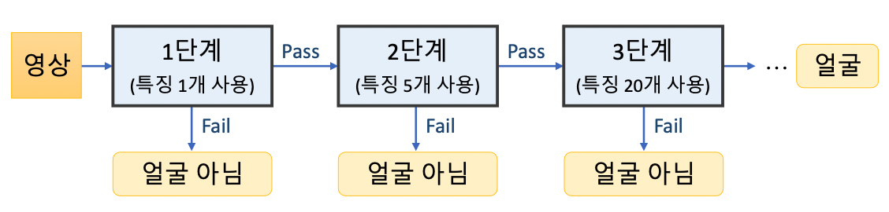

# 7. 영상분할과 객체검출

## 1. 그랩컷
그래프 컷(graph cut) 기반 영역 분할 알고리즘
영상의 픽셀을 그래프 정점으로 간주하고, 픽셀들을 두 개의 그룹으로 나누는 최적의 컷(Max Flow Minimum Cut)을 찾는 방식

그랩컷 영상 분할 동작 방식.
* 사각형 지정 자동 분할
*  사용자가 지정한 전경/배경 정보를 활용하여 영상 분할

자세한 알고리즘 내용 링크 참고 [C. Rother, V. Kolmogorov, and A. Blake, "GrabCut:Interactive foreground extraction usingiterated graph cuts," ACM Trans. Graph., vol. 23, pp. 309–314, 2004](https://grabcut.weebly.com/background--algorithm.html)

```python
cv2.grabCut(img, mask, rect, bgdModel, fgdModel, iterCount, mode=None) -> mask, bgdModel, fgdModel
```
`mask` : `cv2.GC_BGD(0)` , `cv2.GC_FGD(0)` , `cv2.GC_PR_BGD(2)` , `cv2.GC_PR_FGD(3)` 네 개의 값으로 구성. (전경/배경,Probablity)
`rect` : ROI 영역. `cv2.GC_INIT_WITH_RECT` 모드 시 사용.
`bgdModel, fgdModel` : 임시 배경/전경 모델 행렬(1,65). 같은 영상 처치시 변경 금지
`iterCount` : 결과 생성을 위한 반복 횟수
`mode` : `cv2.GC_` 로 시작하는 모드 상수. `cv2.GC_INIT_WITH_RECT` 로 초기화, `cv2.GC_INIT_WITH_MASK` 로 업데이트

> 영상 처리에서는 잘 사용하지 않는다. -> 전경/배경이 명확하게 구분되는 영상에서 잘 작동된다.

## 2. 모멘트 기반 객체 검출
* 모멘트(Moments) :
영상의 형태를 표현하는 일련의 실수값.
특정 함수 집합과의 상관 관계(correlation) 형태로 계산
`Geometric moments` `Central moments` `Normalize central moments` -> OpenCV 지원
`Legendre moments` `ART(Angular Radial Transform)` 등 -> 최신의 방법.
* Hu의 7개 불변 모멘트
3개 이하의 정규화된 중심 모멘트를 조합하여 만든 7개의 모멘트 값
영상의 **크기, 회전, 이동, 대칭 변환**에 불변
```python
# 모양 비교 함수
cv2.matchShape(contour1, contour2, method, param) -> retval 
```
`contour1,2` : 외곽선 또는 grayscale 영상
`method` : 비교 방법 지정. `cv2.CONTOURS_MATCH_I1~3`. `I3`을 추천. ->  $I_3(A,B) = max_{i=1...7}\frac{|m_i^A-m_i^B|}{|m_i^A|}$
`param` : 사용되지 않음. 0 지정.
`retval` : 두 외곽선 또는 grayscale 영상 사이의 거리
Hu 의 불변 모멘트를 이용하여 비교. -> **크기,회전,이동,대칭 변환** 에 강인 
-> *임의의 변형이 있을 시 잘 동작하지 않을 수 있다.*

## 3. 템플릿 매칭
### 1. 이해하기
* 템플릿 매칭(Template matching) :
입력 영상에서 (작은 크기의) 템플릿 영상과 일치하는 부분을 찾는 기법.
템플릿 : 찾을 대상이 되는 작은 영상. 패치(patch), kernel 


```python
# 템플릿 매칭 함수
cv2.matchTemplate(img, templ, method, result=None, mask=None) -> result
```
`templ` : 템플릿 영상. `img` 보다 같거나 작은 크기, 같은 타입
`method` : 비교 방법. `cv2.TM_CCOEFF_NORMED` 이 성능면에서 가장 많이 쓰인다.
`result` : 비교 결과 행렬. `shape=(W-w+1,H-h+1)` -> `cv2.minMaxLoc` 사용해서 확인. 특정 값 이상이 되었을때 찾음.



 > 영상의 크기나 회전 변환 시 잘 작동하지 않는다. -> 8장에서 배울 예정.
 
 ### 2. 인쇄체 숫자 인식(실습)
 * 인식(Recognition) :
	Classifying a detected object into different categories.
	여러 개의 클래스 중에서 가장 유사한 클래스를 선택.
* 템플릿 인식에 경우 자신이 찾고자 하는 경우를 템플릿 사이즈로 resize 한 후 하면 더 잘된다. 


## 4. 캐스케이드 분류기 : 얼굴 검출
* Viola - Jones 얼굴 검출기
	Positive 영상(얼굴 영상) 과 Negative 영상(얼굴 아닌 영상) 을 훈련하여 빠르고 정확하게 얼굴 영역 검출
	차별점 : 유사 하르(Haar-like) 특징 사용. AdaBoost에 기반한 강한 분류 성능. 캐스케이드(cascade) 방식을 통한 빠른 동작 속도
	기존 얼굴 검출방법보다 약 15배 빠르게 동작.
* 특징점
	* 유사 하르 특징(Haar-like features)
		사각형 형태의 필터 집합을 사용. 
		흰색 사각형 영역 픽셀 값의 합에서 검정색 사각형 영역 픽셀 값을 뺀 결과 값을 추출
		
	* 케이케이드(Cascade classifier)
		일반적인 영상에서는 얼굴이 한,두개 , 나머지 영역은 대부분 non-face 영역.
		non-face 영역을 빠르게 넘어가도록 다단계 검사 수행
		

* 캐스케이트 분류기
	* 생성자.
		```python
		# 생성자 or load 로 읽어올수있다. 
		cv2.CascadeClassifier(filename) # <CascadeClassifier object>
		cv2.CascadeClassifier.load(filename) #filename -> XML. 
		```
		XML파일은 OpenCV 제공 [링크](https://github.com/opencv/opencv/tree/master/data/haarcascades)
	* 멀티스케일 객체 검출함수
		```python
		cv2.CascadeClassifier.detectMultiScale(img, scaleFactor=None, minNeighbors=None,
		 flags=None, minSize=None, maxSize=None) -> result
		```
		`scaleFactor` : 영상 축소 비율. 기본값 1.1
		`minNeighbors` : 최종 검출 영역으로 설정할 최소 이웃 사각형 개수. 기본값 3
		`result` : 검출된 객체의 사각형 정보(x,y,w,h) 담은 `np.ndarray`
		파라미터 값을 잘 주면 속도를 빠르게 할수 있다.
> 현재는 딥러닝 기반의 얼굴 검출을 한다. 간단히 사용할때 정도만 사용하면 된다.

## 5. HOG 보행자 검출
* HOG(Histogram of Oriented Gradients)
	영상의 지역적 그래디언트 방향 정보를 특징 벡터로 사용.
	알고리즘
	1.	입력 영상에서 부분 영상 추출
	2.	크기 정규화(64 X 128)
	3.	그래디언트 계산 후 (8X8) 크기의 셀 분할
	4.	각 셀마다 방향,크기 성분 이용해서 방향 히스토그램(20도씩, 9개) 계산. `bin = 9`
	5.	블록 히스토그램 구하기
		5-1. (8X8) 셀 4개를 하나의 블록 지정. -> 블록 하나 크기 16X16
		5-2. 8픽셀 단위 이동 -> `stride = 8 `
		5-3 각 블록의 히스토그램 bin 개수 : 36개(4*9)
		5-4 특징 벡터 크기 : 3780(7 * 15 * 36)
* HOG 분류기
	```python
	# 분류기 및 분류기 계수
	cv2.HOGDescriptor() -> <HOGDescriptor object>
	cv2.HOGDescriptor_getDefalutPeopleDector() -> retval # 미리 훈련된 특징 벡터
	# SVM 분류기 계수 등록
	cv2.HOGDescriptor.setSVMDetector(svmdetector) # svmdetector에 미리 훈련된 특징 벡터 넣어줌.
	```
	* HOG 멀티 스케일 객체 검출 함수
	```python
	cv2.HOGDescriptor.detectMultiScale(img, hitThreshold=None, winStride=None, padding=None,
									   scale=None,finalThreshold=None,useMeanshiftGrouping=None) 
									    -> foundLocations, foundWeights, 
	```
	`img` : 입력 영상.
	`scale` : 검색 윈두오 크기 확대 비율 기본값 1.05. 해당 값 제외 건드릴게 없다고 봐도 무방.
	`foundLocations` : 검출된 사각형 영역 정보
	`foundWeights` : 검출된 사각형 영역에 대한 정보


## 6. 실습
카메라 입력 영상에서 얼굴 검출하여 그래픽 합성하는 프로그램.
구현할 기능 
1. 카메라 입력 영상에서 얼굴 & 눈 검출하기
2. 눈 위치와 맞는 투명한 PNG 파일 합성하기
