# 8. 특징점 검출과 매칭

## 1. 코너 검출
* 특징
	평탄한 영역(flat) & 엣지(edge) 영역은 고유한 위치를 찾기 어렵다.  
	코너(corner) 는 변별력이 높은 편이며, 영상의 이동,회전 변환에 강인하다.  
	크기 변환에는 취약하다  
* 다양한 코너 검출 방법
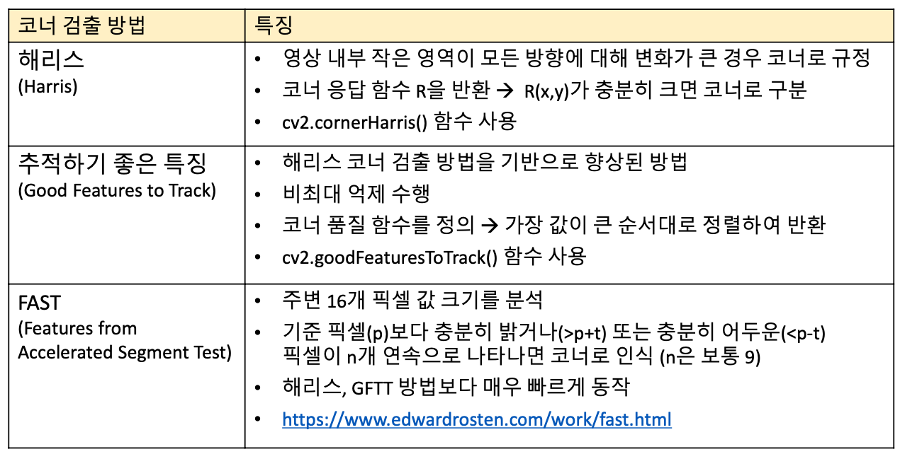
-> 가장 빠른 FAST 방법을 주로 사용한다.
	1. 해리스 코너 응답함수
	```python
	cv2.cornerHarris(src, blockSize, ksize, k, dst=None, borderType=None) -> dst
	```
	`blockSize` : 계산에서 고려할 이웃 픽셀 크기. 보통 2~5  
	`ksize` : 소벨 연산자 위한 커널 크기 보통 3  
	`k` : 해리스 코너 검출 상수 보통 0.04~0.06  
	`dst` : 해리스 코너 응답 계수. src와 같은 크기 행렬 -> 후처리 해야된다.  
	2. 추적하기 좋은 특징 코너 검출
	```python
	cv2.goodFeaturesToTrack(image, maxCorners, qualityLevel, minDistance, 
							corners=None, mask=None, blockSize=None,
							useHarrisDetector=None, k=None) -> corners
	```
	`maxCorners` : 최대코너 개수. `<= 0` 이면 무제한.  
	`qualityLevel` : 코너점 결정을 위한 값. 보통 0.01~0.1  
	`minDistance` : 코너점 사이의 최소 거리  
	`corners`  : 검출된 코너점 좌표 `shape = (N,1,2)`  
	나머지 파라미터는 기본값 쓰면 된다.  
	3. FAST 코너 검출
	```python
	# FAST 객체
	cv2.FastFeatureDetector_create(,threshold=None, nonmaxSupperssion=None, type=None) -> retval
	# detect
	cv2.FastFeatureDetector.detect(img) -> Keypoints
	```
	`threshold` : 중심 픽셀값과 주변 픽셀 값과의 차이 임계값. 기본값 10  
	나머지 파라미터는 디폴트 값이 가장 좋은 성능을 보인다.  
	`Keypoints` : 검출된 코너점 정보. `cv2.KeyPoint` 객체 리스트. `cv2.KeyPoint` 의 `pt` 멤버(X:pt[0],Y:pt[1]) 이용하여 코너 좌표 추출

* 성능 비교
	FAST 방법의 반복 검출률이 대체로 높음. 다만 노이즈에 민감하다.  
	#가우시안 블러로 노이즈 제거 후 진행  
	
	

## 2. 특징점 검출
Harris, GFTT, FAST 코너의 문제점인 **크기 변환** 에 대해서 다양한 크기 관점에서 특징 검출을 하는 방법으로 해결. -> 해당 점을 **특징점** (키포인트,관심점,기술자,특징벡터 의미가 거의 비슷하다)

* 크기 불변 특징점 검출 방법
	SIFT, KAZE, AKAZE, ORB 등 다양한 특징점 검출방법에서 스케일 스페이스(scale-space) , 이미지 피라미드(image pyramid) 를 구성하여 검출
	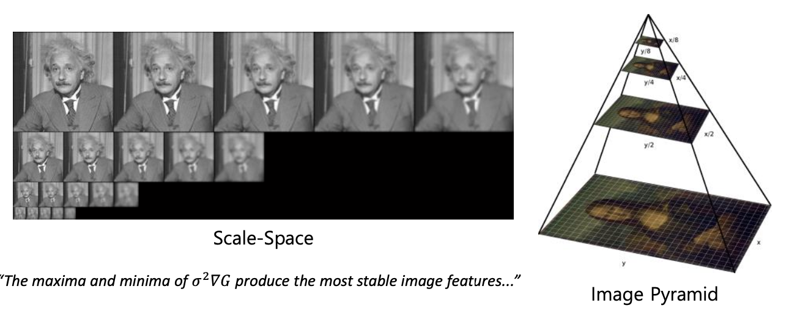

* OpenCV 특징점 검출 클래스 : Feature2D 클래스와 파생 클래스
	Only 검출 / 기술 or 둘다 할수 있는게 있다. -> 구분해서 잘 써야한다.  
	`cv2.KAZE` , `cv2.AKAZE` , `cv2.ORB` 실습.
	[OpenCV 문서 참고](https://docs.opencv.org/master/d0/d13/classcv_1_1Feature2D.html)
	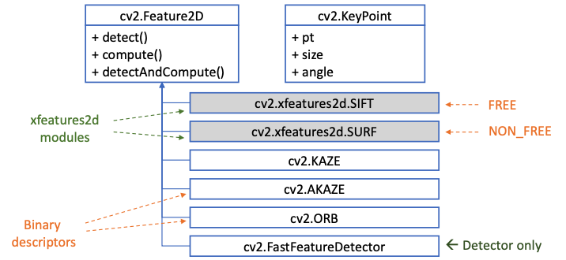
	
*  특징점 검출 알고리즘 객체
	* 생성
	각 이름에 `_create` 붙여주면 된다. -> 대부분의 인자는 기본값을 가지고 있음으로 함수 인자없이 호출 가능하다. ex) `cv2.KAZE_create()`
	* 검출
	생성된 객체에 `detect` 함수 사용. `cv2.KeyPoint` 객체 리턴.  
	`cv2.KeyPoint` 는 `pt(좌표)` , `size` , `angle(방향)` 등등 가지고 있다.
	* 그리기 함수
	`cv2.drawKeypoints(img, keypoints, outImage, color=None, flags=None) -> outImage` 
	`flags` : 특징점 표현방법.   
	-> `cv2.DRAW_MATHCES_FLAGS_DEFAULT` : 특징점 위치만 표현하는 작은 크기의 원  
	-> `cv2.DRAW_MATHCES_FLAGS_DRAW_RICH_KEYPOINTS` : 특징점의 크기와 방향을 반영한 원.  

## 3. 특징점 기술
* 기술자(descriptor, feature vector)
	특징점 근방의 부분 영상을 표현하는 실수 또는 이진벡터  
	OpenCV에서는 2차원 행렬(`np.ndarray`) 표현.  	
	행 개수 : 특징점 개수(실수는 `np.float32` , 이진은 `np.uint8`)  
	열 개수 : 특징점 기술자 알고리즘에 의해 정의된다.  

* 실수 기술자
	주로 특징점 부근 부분 영상의 방향 히스토그램을 사용.   
	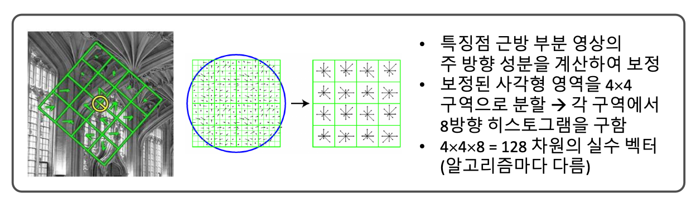
	사용하는 알고리즘 : `SIFT, SURF, KAZE` 등  
	실수는 보통 `L2 norm` 을 사용해 유사도 판단.  

* 이진 기술자(Binary descriptor) 
	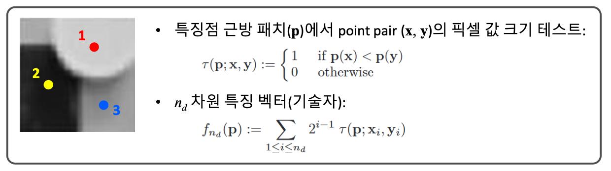
	사용하는 알고리즘 : `AKAZE, ORB, BRIEF` 등   
	이진은 `Hamming distance` 사용. (같은 위치에서 다른 값(1,0)이 몇개인지 셈) [위키참고](https://ko.wikipedia.org/wiki/%ED%95%B4%EB%B0%8D_%EA%B1%B0%EB%A6%AC)

* 관련 함수
	1.  특징점 기술자 계산 함수
		`cv2.Feature2D.compute(img, keypoints, descriptors=None)`-> keypoints, descriptors
	2. 특징점 검출 및 기술자 계산
		`cv2.Feature2.detectAndCompute(img, mask=None, descriptors) -> keypoints, descriptors`
		실재 검출, 기술이 모두 가능한 함수를 불러와야한다.

* OpenCV 주요 특징점 알고리즘 및 성능
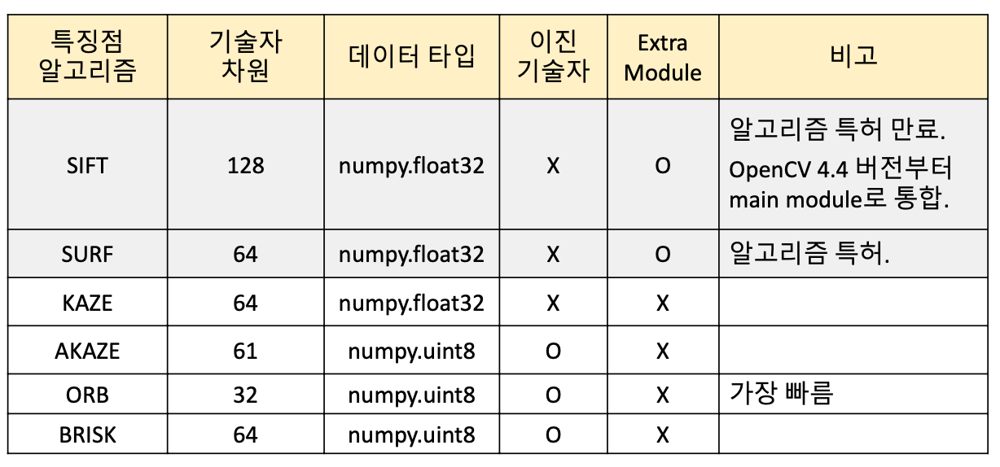
	속도면에선 `cv2.ORB` 가 제일이지만 정확도면에선 `cv2.SIFT` 나 `cv2.AKAZE` 가 우수. -> 상황에 맞게 적절한 알고리즘을 선택합시다.  
	[관련 논문](http://www.diva-portal.org/smash/get/diva2:927480/FULLTEXT01.pdf)

## 4. 특징점 매칭
두 영상에서 추출한 특징점 기술자를 비교하여 서로 유사한 기술자를 찾는 작업
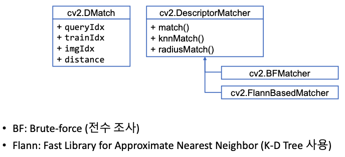. 
상속받은 `cv2.BFMatcher` 나 `cv2.FlannBaseMatcher` 를 사용한다.  
`cv2.DMatch` 클래스를 반환.   
	`queryIdx` 는 첫번째 영상의 특징점 번호.  
	`trainIdx` 는 두번째 영상의 특징점 번호. 
	`imgIdx` 두번째 영상이 여러개일 경우. 번호.   
	`distance` 유사도 값.  

* 특징점 매칭 알고리즘 객체 생성
	```python
	cv2.BFMatcher_create(, normType=None, crossCheck=None) -> retval
	```
	`normType` : 기본값은 `cv2.NORM_L2`, 이진 벡터 사용시 `cv2.NORM_HAMMING`  
	`crossCheck` : T - 양방향 매칭 결과가 같은 경우만 반환. 기본값 F. 

* 특징점 검출 알고리즘 객체 생성
	```python
	cv2.DescriptorMatcher.match(queryDescriptors, trainDescriptors, mask=None) -> matches
	cv2.DescriptorMatcher.knnmatch(queryDescriptors, trainDescriptors, k, mask=None, compactResult=None) -> matches
	```
	`queryDescriptors` : 기준 영상 특징점 기술자 행렬  
	`trainDescriptors` : 대상 영상 특징점 기술자 행렬  
	`k` : 검출할 매칭 개수  
	`mask` : 매칭 수행 여부 지정하는 행렬 마스크  
	`matches` : 매칭 결과. `cv2.DMatch` 객체 리스트  

* 특징점 매칭 결과 영상 생성
	```python
	cv2.drawMatches(img1, kp1, img2, kp2, matches1to2, outImg, ...) -> outImg
	```
	`img1,kp1` : 기준 영상 + 기준 영상 추출한 특징점. 
	`img2,kp2` : 대상 영상 + 대상 영상 추출한 특징점. 
	`matches1to2` : 매칭 정보.  
	`outImg` : 출력 영상. 
	나머지 인자값들은 기본값으로 해도 무방. OpenCV 홈페이지 참고.

> 매칭 결과 중 좋은 매칭 결과만 가져오는 정제과정이 필요하다. 

## 5. 좋은 매칭 선별
1. Distance 를 기준으로 선별.
	매칭 결과 중 distance 값이 작은 것 N개 사용  
	`cv2.DMatch.distance` 값 기준으로 정렬 후 상위 N개 선택  

2. Distance 2개의 비율을 계산
	`cv2.knnMatch` 를 사용해 2개의 매칭 결과를 얻는다.  
	$\frac {closestDistance}{nextclosestDistacnce} < Th$ 인 값을 선택한다.  
	```python
	# 예제 코드(임계값 0.7)
	matcher = cv2.BFMatcher_create()
	matches = matcher.knnMatch(desc1,desc2,2)
	good_matches = []
	for m in matches :
		if m[0].distance / m[1].distance < 0.7 :
			good_matches.append(m[0)
	```
> 이렇게 해도 잘못된 매칭이 나올 수 있다.

## 6. 호모그래피와 영상 매칭
두 평면 사이의 투시 변환(Perspective transform)
8DOF : 최소 4개의 대응점 좌표가 필요하다.
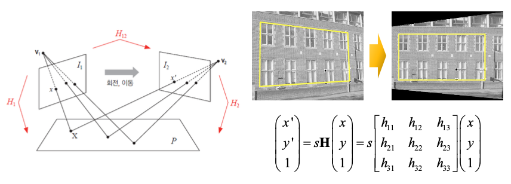

너무 많은 대응점이 있다. + 그 대응점 안에는 완전히 잘못된 대응점이 있을 수있다. 
-> 호모그래피 계산 함수에서 `RANSAC` 방법으로 계산.
* RANSAC 
	Random sample consensus.  
	이상점(Outlier) 가 많은 경우 적용할 수 있는 알고리즘.  
	샘플을 선정. 직선의 방정식을 그리고, 정해진 범위 내에 있는 점의 개수를 셈. -> 가장 많은 점이 있는 직선의 방정식을 리턴해준다.  
	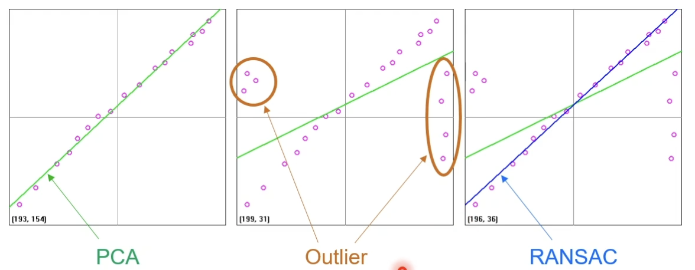

* 호모그래피 계산 함수
	```python
	cv2.findHomography(srcPoints, dstPoints, method=None, ...) -> retval, mask
	```
	`srcPoint, dstPoints` : 입력/결과 점 좌표. `shape=(N,1,2)` , `dtype=np.float32`  
	`method` : 호모그래피 행렬 계산 함수. 기본값 0. 이상치 있는 경우 `cv2.RANSAC` 권장.  
	`retval` : 호모그래피 행렬. `shape=(3,3)` , `dtype=np.float32`
	`mask` : 출력 마스크 행렬. Inlier 로 사용된 점들을 1로 표시한 행렬. `shape=(N,1)`

> 일반적인 사진에 대한 매칭에 유용하다.

## 7. 이미지 스티칭
동일 장면의 사진을 자연스럽게(seamless) 붙여서 한 장의 사진으로 만드는 기술
사진 이어 붙이기, 파노라마 영상, [관련 논문](http://matthewalunbrown.com/papers/ijcv2007.pdf)

특징점 검출 -> 매칭된 특징점만 남겨둠 -> 호모 그래피 행렬 구함 -> 매칭해서 이어붙이면된다.
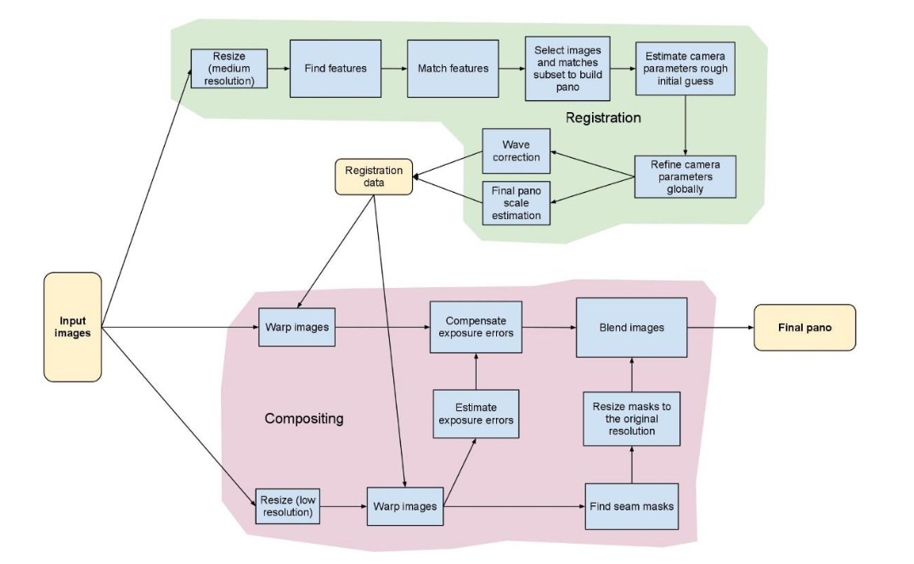
[OpenCV 제공 클래스](https://docs.opencv.org/master/d1/d46/group__stitching.html)

* 이미지 스티칭 객체 생성
	```python
	cv2.Stitcher_create(,mode=None) -> retval
	```
	`mode` : 스티칭 모드 `cv2.PANORAMA` , `cv2.SCANS`. 기본적인 사진은 `cv2.PANORAMA`사용  
	`retval` : `cv2.Sitcher` 클래스 객체  
* 이미지 스티칭 함수
	```python
	cv2.Stitcher.stitch(images, pano=None) -> retval, pano
	```
	`images` : 입력 영상 리스트  
	`retval` : 성공하면 `cv2.Stitcher_OK`  
	`pano` : 파노라마 영상  

## 8. 실습
* AR비디오 플레이어
	카메라에 특정 영상이 나타나면 해당 위치에 동영상을 재생하는 기능
* 구현할기능  
	* 기준영상과카메라프레임사이의특징점검출및매칭
	* 호모그래피계산  
	* 동영상프레임투시변환&합성
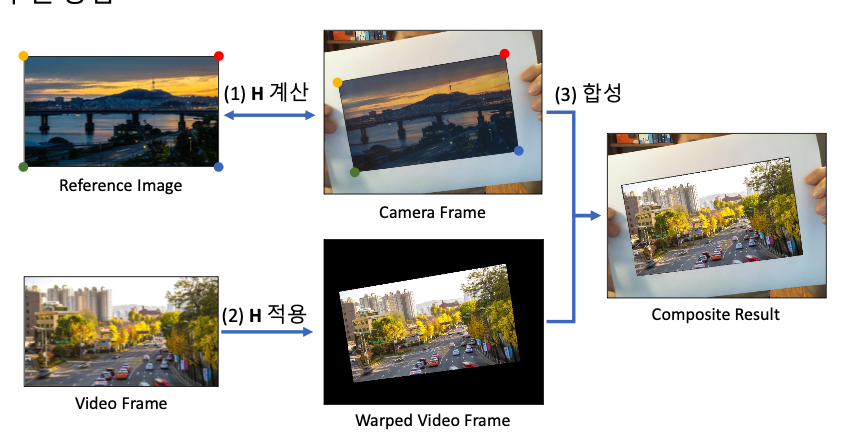

